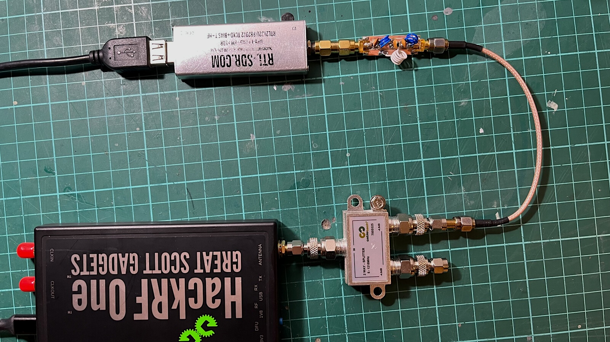
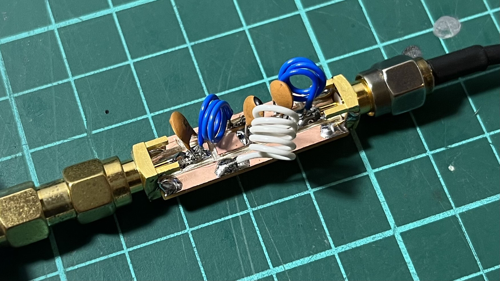
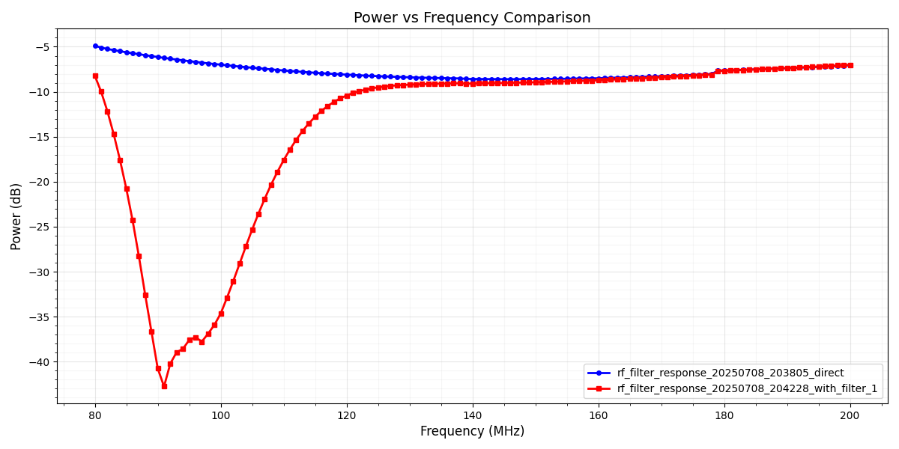
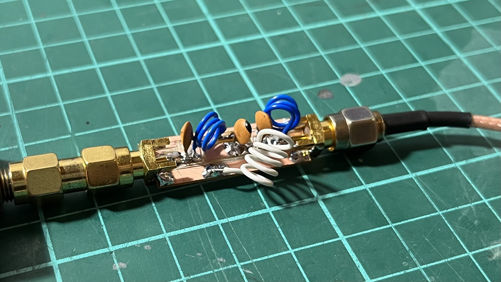
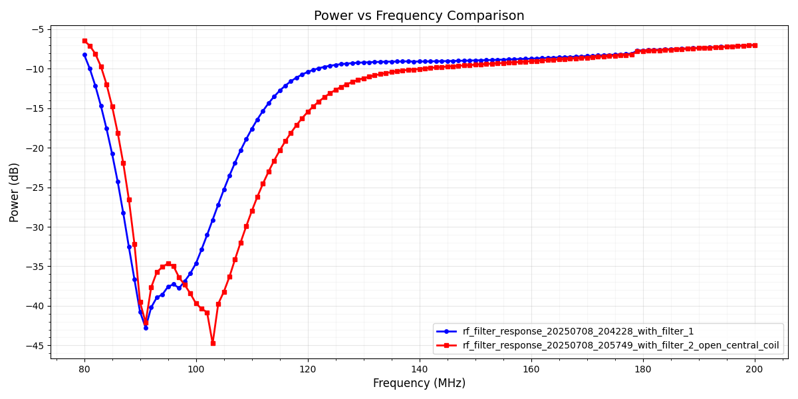
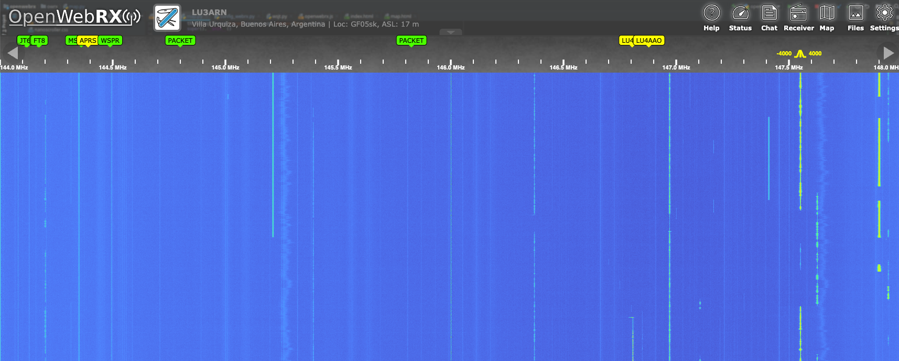

Whenever I mount an SDR to listen in the 144-148 MHz band, I try to filter out the broadcast FM signals. This is due to the lack of proper filtering or channelization in the Software-Defined Radio receivers I use. The filter I use most is one described in the [LNA4ALL blog](http://lna4all.blogspot.com/2015/10/diy-fm-trap-or-88-108-mhz-band-stop.html). I even bought them a few LNAs and filters as well.

The filter is extremely easy to build; you just need a small amount of copper wire, such as the type used in a telephone line pair, a small 30 x 10 mm PCB, and three ceramic capacitors.

I even built a few of these filters while at my parents' house, where my father has a NanoVNA vector analyzer, which makes filter adjustment easier. I don't have one at home yet, and I wanted to tune the filter by adjusting the inductors, so I built an RF sweeper using what I had at hand: a HackRF and an RTL-SDR v3.

The theory is simple: the HackRF would transmit an IQ sample at a given frequency, with a given sample rate and power. The RTL-SDR v3 would tune in the same frequency as the HackRF and take a few samples of the signal magnitude. Then both devices would move upwards in frequency.

After a few tests to ensure everything was working as expected, I attempted to improve the filtering capabilities, but I failed. I simply failed. The best cutting frequency I got was with the untouched filter specs. Opening up the 126nH inductor winding shifts the filter's cut frequency downward.

This little project turned out way better than expected. I didn't manage to improve the filter, as it turns out the LNA4ALL guys knew what they were doing from the start. However, I now have a simple RF sweeper that works quite well for basic measurements. Sometimes, the tools you build yourself end up being more useful than the original project for which you built them. Also, I learned a lot during this journey.

Check [my repository at GitHub](https://github.com/reynico/rf-response-sweep) for more information, code, and example measurements.

Ah, oh, I almost forgot! Yes, the OpenwebRX+ receiver now has a lower noise level, and stations emboss a bit more, you can compare it with the [initial setup I made in December](https://blog.nico.ninja/dual-band-openwebrx/):

