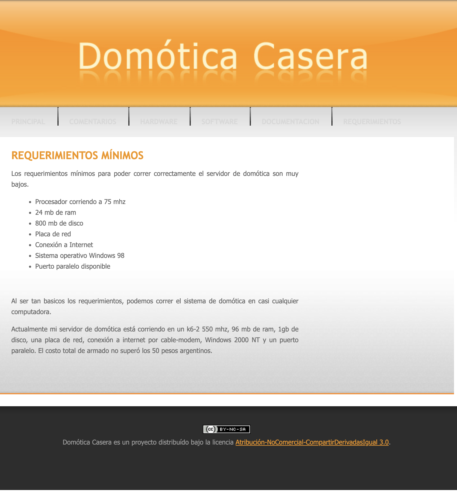
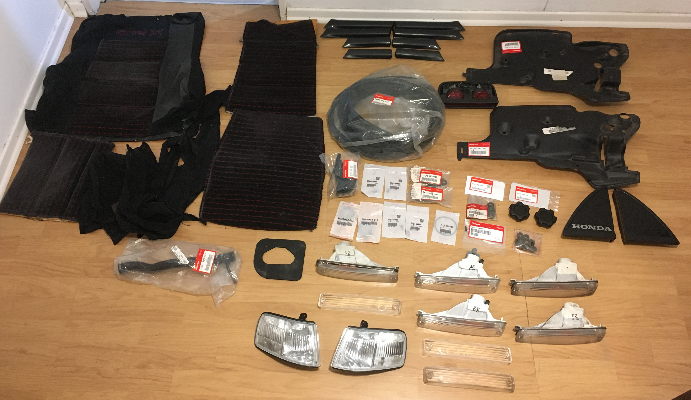

A few weeks ago, I was walking through [Parque de El Retiro in Madrid](https://en.wikipedia.org/wiki/Parque_del_Buen_Retiro,_Madrid) with my friend [Manu](https://manu.show/). During our 1:30-hour walk, we discussed many interesting topics, one of which sparked my ideas: obsession.

### What are you obsessed with?

Obsession is a great driver for accomplishing complex and intricate goals, but also for propelling us towards some obscure destinations. I always struggle to focus on the beneficial aspects of being obsessed with something, as it's easy to get carried away. Once you've gone too far, the storm hits.

But how do you avoid being hit by the storm? Well, the most obvious answer is: don't go out on a stormy day. But that's not realistic, we need (and even we like) going out on stormy days. One thing that helps me avoid falling into the downward spiral of obsession is looking at myself in the mirror whenever I don't feel at peace. Seeing my eyes, skin, and lips. The human body responds incredibly fast to stress (for the good and for the bad), you can quickly know you are exceeded, skin quality lows down, eyes become dry, you get chapped lips, you have bags under your eyes, you feel thirsty (dehydrated), caffeine doesn't hit in a good way, instead, it gets you an anxiety boost. Everything is reflected in our bodies, in the things we see every day.

When I suspect I'm not doing well, I head to the mirror to analyze what I see. If any of the described symptoms are happening, I immediately go to my notebook. I write about how I feel, what I'm doing, and what might be driving me this way. It could be anything, from financial to family to work to something that happened that morning in the gym. However, most of the time, I'm dragging something out for a few days (or weeks/months), which requires further investigation. I usually start with these questions:

- Why am I doing this?
- Do I want to do this?
- What am I expecting to happen from this thing?
- Is it worth it?
- How long will it take until I find myself in a better place? (assuming the thing that caused me this feeling is something that would put me in a better place). This could be *very* hard to answer, especially during the struggling period. I suggest leaving this for another moment.

These questions can be challenging to answer, so you may need a few hours or a few days to complete them all. Once done, I usually find a sense of relief in my body, because I can articulate my mind and feelings in written words (handwritten works best), which means I have at least some clarity on what is making me feel this way. What I just did improves my overall clarity.

That is how I handle the bad side of being obsessed with something.

### But what about the good side of obsession? 

How does it feel? How is it managed?

Being genuinely obsessed with something really sparks joy; you feel energized, you go to bed thinking of it, and you wake up replenished, with your energy focused on working on it. Again, it could be anything, from financial to family, work, or even something related to your gym routine.

You drive through a tunnel of ideas and solutions, and you have complete clarity on what you are thinking, which becomes very obvious in the moment you want to share that idea with someone else. It is so crystal clear that you can just explain the most complicated thing in simple words, and the other person understands you fully.

I have a few current obsessions that I'm really enjoying. Here are a few, but not all:

- **Isolated home automation:** Home automation is one of my older obsessions. I started working on it in 2006, when I was 15 or 16 years old. I started by coding software that controlled a computer's parallel port, allowing users to manage sensors and motors through a web server, either from their phone or another computer. I have never abandoned this obsession; instead, I have refined it over time, and now I run a Home Assistant server with several (over 30) custom-made ESPHome devices.

> This was one of my first projects on home automation.
    

- **Car restoration:** In 2014, I purchased my first car, a 1991 Honda CRX, in decent condition, although not perfect. I embarked on a fantastic journey spanning over 10 years, exploring old, closed shops, meeting people online through forums, and making purchases from all over the world, ultimately ending up with a pile of OEM and new old stock car parts for my Honda, which I restored down to the last screw, painted, tuned and enjoyed up to today.

> Some OEM/NOS parts for Honda CRX. Probably under 3% of all the parts I accumulated during a decade.

- **Systems:** Systems, in general, are something that sparks a lot of joy in me. I am always learning how to optimize my systems for habits, wellness, work, and overall wellbeing. For example, during 2024, I read fourteen books, divided into technical, psychological, and habits categories. I started consciously optimizing my systems not long ago. Still, I devote a significant amount of time and energy to this field every time I can. [You can read more about them here](https://blog.nico.ninja/my-system/).

- **Music:** I have always enjoyed electronic music since I was a kid. My father introduced me to Giorgio Moroder and Kraftwerk records from the 70s, and that opened a tunnel of obsession in my mind. I currently scour the internet for records and old school electronic music sets. I am currently obsessed with [Hernán Cattaneo's sets from the 1990s to the 2000s](https://soundcloud.com/search/sets?q=rave_on%20cattaneo). That mix of house and groovy sounds takes me right back in time, as if I were there.

Although there is a thin line between doing great with obsession and driving me crazy, I always find a lot of positive outcomes from them. I'll never master obsession in the sense of not falling behind the storm, but I really prefer it as it is.

What are you obsessed with?