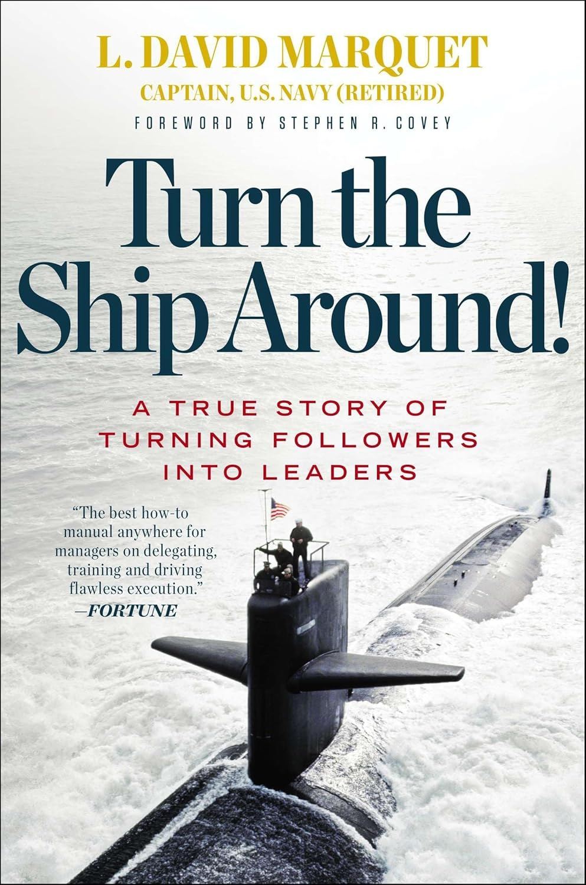

I first learned about the concept of a lever when I was a kid, working on a construction site. Despite being a hostile job (especially for a young person), having to carry construction debris with a wheelbarrow (a second-grade lever) or mix cement with a shovel (a third-grade lever) made things easier than carrying debris and cement by oneself.

Through the years, as I gained more context about the world I live in, I continued to learn about levers in various scenarios. Mundane things, such as riding a bike in the neighborhood, involve multiple levers, including brakes and pedals, as well as when using a hammer or a set of pliers (double first-grade levers) when building a tree house.

As I learned about economics, I learned about how one can leverage different investments to gain advantages over strategic resources and then achieve more juicy outputs (or dig your own grave).

Nowadays, the type of leverage I enjoy most involves working with people. People become powerful levers when you're focused on building something. Since no one excels in every aspect or field needed, channeling specific problems to those with the right expertise multiplies your efforts exponentially. One hour of your time coordinating can generate dozens of hours of focused work.

However, not all coordination creates leverage—sometimes it does the opposite. I've learned this the hard way through countless meetings that felt more like time dividers than multipliers. The classic anti-pattern is the meeting without a clear purpose, where everyone sits around a table sharing updates that could have been an email.
How to avoid this anti-pattern? Conclude every meeting with clear action items for all participants. If people leave the meeting without action items on their plates, they probably didn't need to be there.

Another leverage killer is micromanagement disguised as coordination. When you spend more time explaining how something should be done than it would take to do it yourself, you've created negative leverage. The same happens when you become a bottleneck—requiring your approval for every small decision, turning your team into people who wait rather than people who act.
How to avoid this? Set clear expectations about outcomes, not methods. And create explicit decision-making frameworks—define what requires your input and what doesn't, then trust people to execute within those boundaries.

The key to effective human leverage lies in recognizing the right moments and the right people. I look for situations where someone else has deep expertise in an area I don't, especially when that expertise can solve problems that would take me weeks to figure out. It's also about timing—there's a sweet spot where the problem is well-defined enough that I can communicate it clearly, but not so urgent that coordination time becomes a luxury I can't afford. 

The best leverage opportunities happen when you can provide context and direction that unlocks parallel work. Instead of doing five tasks sequentially yourself, you coordinate once and watch five people tackle them simultaneously, each bringing their specialized knowledge to bear on the specific challenge they're best equipped to handle.

This shift from doing everything yourself to orchestrating outcomes through others represents a fundamental transformation in mindset. Leaders are always pursuing individuals who think like leaders, not followers. They want team members who can identify leverage points and act on them, rather than waiting to be told what to do. One book that taught me a lot about it is ['Turn the Ship Around' by David Marquet](https://www.amazon.com/Turn-Ship-Around-Turning-Followers/dp/1591846404). It's the best book I've read on how great leaders multiply their impact by developing other leaders, rather than creating more followers.

This also extends to peer relationships. When you invest time developing colleagues—mentoring, sharing resources, advocating for their growth—you're creating leverage that benefits everyone. Their increased effectiveness multiplies your team's capacity while demonstrating the leadership behavior that advances your own career.

The biggest leverage opportunity you're probably missing is the one you're too shy to ask for. That meeting with your CEO or CTO to discuss how to accelerate a project or solve a persistent problem? Schedule it. Most leaders got where they are because they understand leverage better than anyone—they want to see problems solved efficiently, not watch you struggle alone for weeks. One conversation with the right person can unlock resources, remove obstacles, or provide context that completely transforms your approach. The worst they can say is no, but more often than not, they'll appreciate that you're thinking strategically about multiplying impact rather than just grinding through tasks.
