> A note for the readers: This project is fully documented (from a technical perspective) in [reynico/radioberry-setup](https://github.com/reynico/radioberry-setup)

Shortly after finishing the [Vertex VX1700 RadioBerry build](), my dad showed up at the workshop with a Yaesu FT-80C he had stored away for years. The radio was fully working - nothing wrong with it - but it was just sitting there unused. "What if we turn this one into a RadioBerry too?" he asked.

The FT-80C (also sold as FT-747GX) is a classic late-80s HF transceiver. Unlike the VX1700, where I built a completely new front panel with a touchscreen, this time I wanted to preserve the original look. The challenge was clear: make the RadioBerry control everything while keeping the radio looking exactly like it did 35 years ago, ensuring aesthetic integrity while adding modern functionality.

[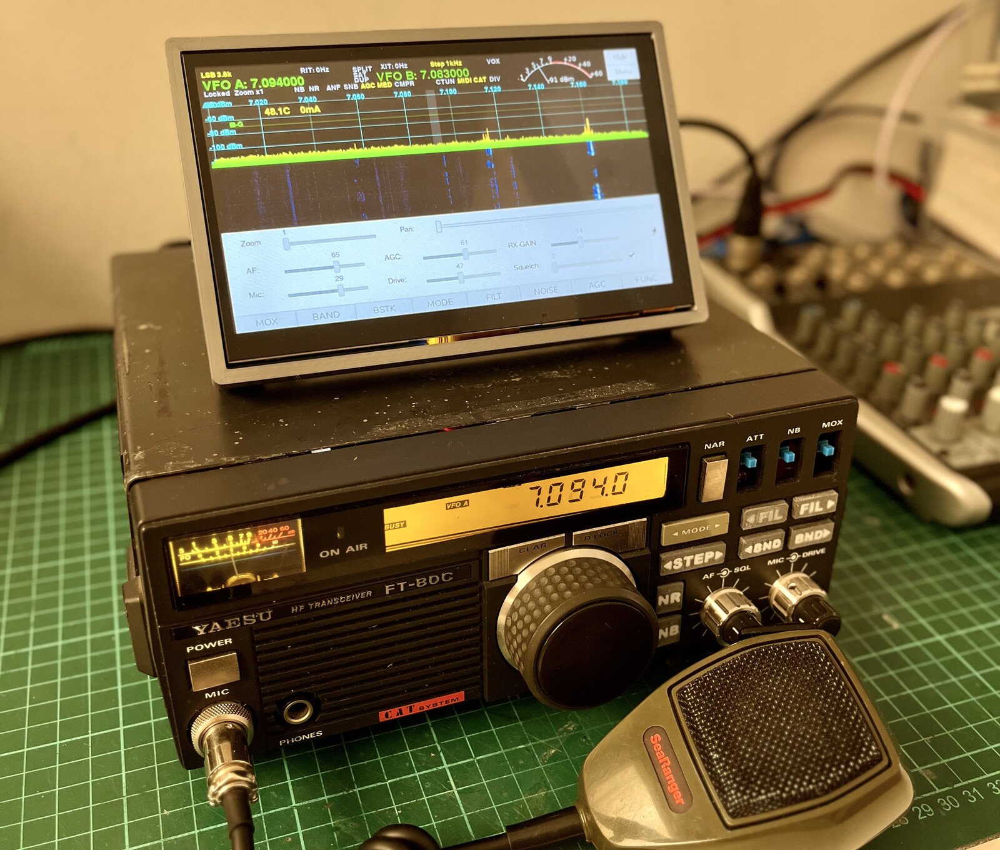](../assets/images/radioberry-ft80c-1/header.jpg){:target="_blank"}

The process of building four boards, reverse engineering the display, and integrating controls was challenging, but sharing this journey aims to inspire your own projects.

## Table of contents

- [Table of contents](#table-of-contents)
- [First steps: understanding what I had](#first-steps-understanding-what-i-had)
- [LPF Control and TX switching](#lpf-control-and-tx-switching)
- [MIDI Controller for the front panel](#midi-controller-for-the-front-panel)
  - [Button mapping](#button-mapping)
- [LCD Controller](#lcd-controller)
  - [Reverse engineering the original controller](#reverse-engineering-the-original-controller)
  - [Finding the HT1621B](#finding-the-ht1621b)
  - [Wiring 35 connections](#wiring-35-connections)
  - [Mapping 128 segments](#mapping-128-segments)
  - [Connecting to piHPSDR](#connecting-to-pihpsdr)
  - [S-meter](#s-meter)
- [Power Supply and Soft Shutdown](#power-supply-and-soft-shutdown)
  - [Voltage regulation](#voltage-regulation)
  - [Soft shutdown circuit](#soft-shutdown-circuit)
  - [Mounting everything](#mounting-everything)
- [Putting it all together](#putting-it-all-together)
- [3D Printed Front Panel Buttons](#3d-printed-front-panel-buttons)
- [The 7" LCD Display Challenge](#the-7-lcd-display-challenge)
- [Frequency calibration: from Hz to PPM](#frequency-calibration-from-hz-to-ppm)
- [What's still missing](#whats-still-missing)
- [Lessons learned](#lessons-learned)

## First steps: understanding what I had

Before touching anything, I spent a couple of evenings just studying the radio. The [FT-80C service manual](../assets/files/radioberry-ft80c-1/ft-80c-service-manual.pdf) was helpful. What I did have was:

- A working PA stage capable of 100W output
- Six low-pass filters on the LPF board, with their relay drivers intact
- The original LCD display (a mysterious custom part labeled FTD8627PZ)
- All front panel controls are in working condition

[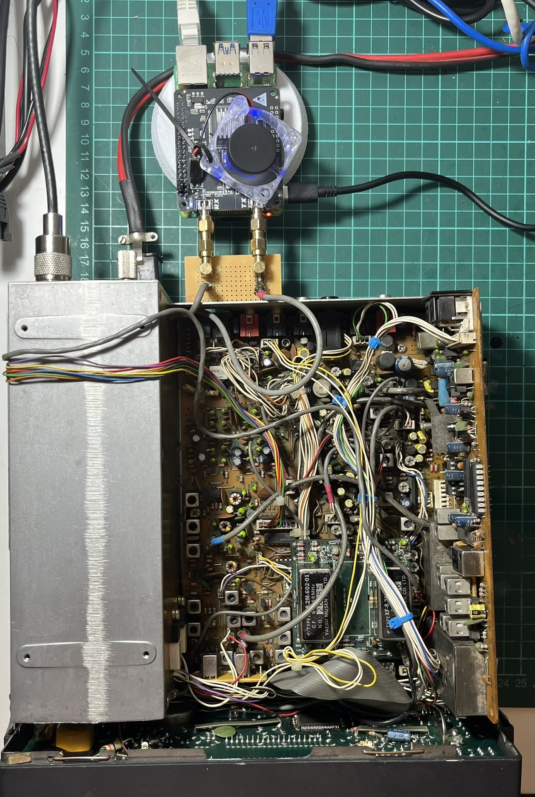](../assets/images/radioberry-ft80c-1/ft80c-initial-open.jpeg){:target="_blank"}

The plan was to use the RadioBerry as the brain, feeding its output (about 100-150mW) into the existing PA stage. The tricky part would be controlling everything else: filter selection, TX/RX switching, the display, and all those buttons.

I approached this in stages, building and testing each board individually, hoping to show you that a methodical process can lead to reliable results.

## LPF Control and TX switching

The first board I built handles the low-pass filter selection and TX/RX switching. In the original radio, a BCD-to-decimal decoder on the main board drives the filter relays. Since I removed the main board, I needed a replacement.

An Arduino Nano was perfect for this. It emulates an [Alex filter board](https://openhpsdr.org/alex.php) (the standard filter interface for HPSDR projects) by listening on I2C address `0x21`. When the RadioBerry changes bands, it sends a command, and the Arduino activates the corresponding filter relay.

[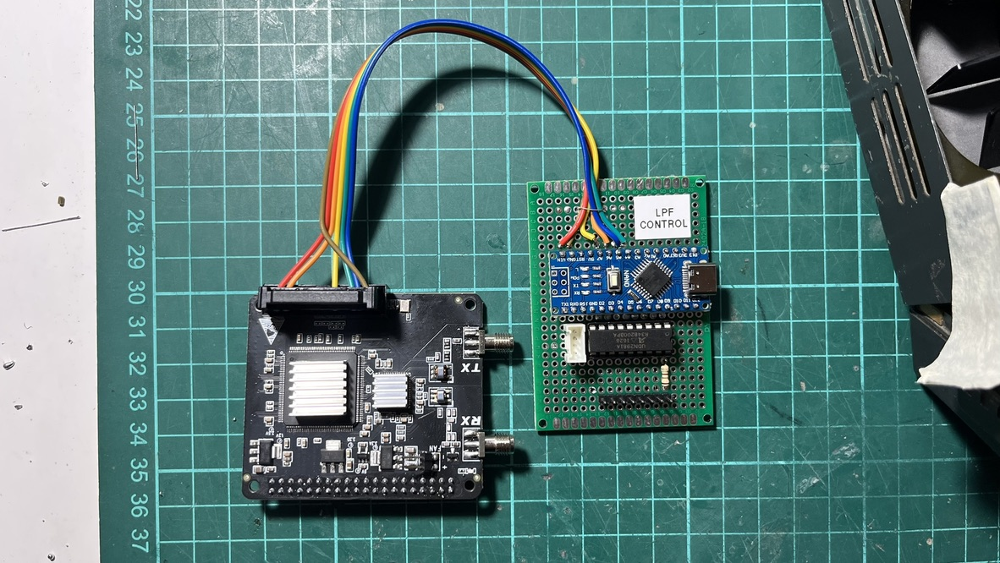](../assets/images/radioberry-ft80c-1/radioberry-lpf-control-separate.jpeg){:target="_blank"}

The FT-80C has 6 filters covering all HF bands. Since I'm driving them directly (not through the original BCD decoder), I use a [UDN2981](../assets/files/radioberry-ft80c-1/UDN2981.pdf) source driver. It's basically the PNP version of the popular ULN2003 - each output can sink the ~40mA the filter relays need.

| Band | Alex Command | Arduino Pin | Filter | Frequency |
| ---- | ------------ | ----------- | ------ | --------- |
| 160M | 1608         | D8          | LPF1   | 1.8 MHz   |
| 80M  | 1604         | D7          | LPF2   | 3.5 MHz   |
| 60M  | 1602         | D6          | LPF3   | 7 MHz     |
| 40M  | 802          | D6          | LPF3   | 7 MHz     |
| 30M  | 401          | D5          | LPF4   | 10/14 MHz |
| 20M  | 101          | D5          | LPF4   | 14 MHz    |
| 17M  | 164          | D4          | LPF5   | 18/21 MHz |
| 15M  | 264          | D4          | LPF5   | 21 MHz    |
| 12M  | 232          | D3          | LPF6   | 24.5/28   |
| 10M  | 232          | D3          | LPF6   | 28 MHz    |

The same board also handles PTT. The RadioBerry's PTT output is active-low at 3.3V. Still, the TX relay on the LPF board expects around 7.5V (I measured the original circuit). A 180 ohm series resistor drops the 13.8V down to the right level for the relay coil.

[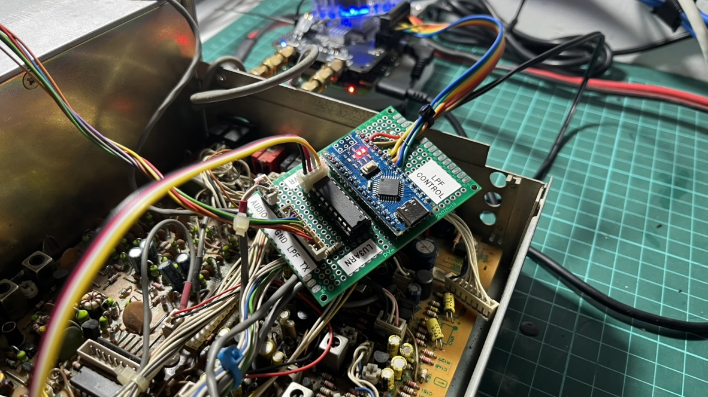](../assets/images/radioberry-ft80c-1/lpf-control-mounted.jpeg){:target="_blank"}

I labeled the board "LPF CONTROL" with a piece of tape - not the most professional approach, but it helps when you're debugging at 2am and can't remember which board does what.

The first time I powered everything up and heard the relays clicking as I changed bands in piHPSDR, it felt like real progress.

At this point, I started actually using the radio. I connected an AKG D5 microphone through a Behringer Q802 mixer via USB for audio input. The audio quality was impressive - the combination of a decent dynamic mic and the RadioBerry's clean signal path made for really nice SSB audio.

[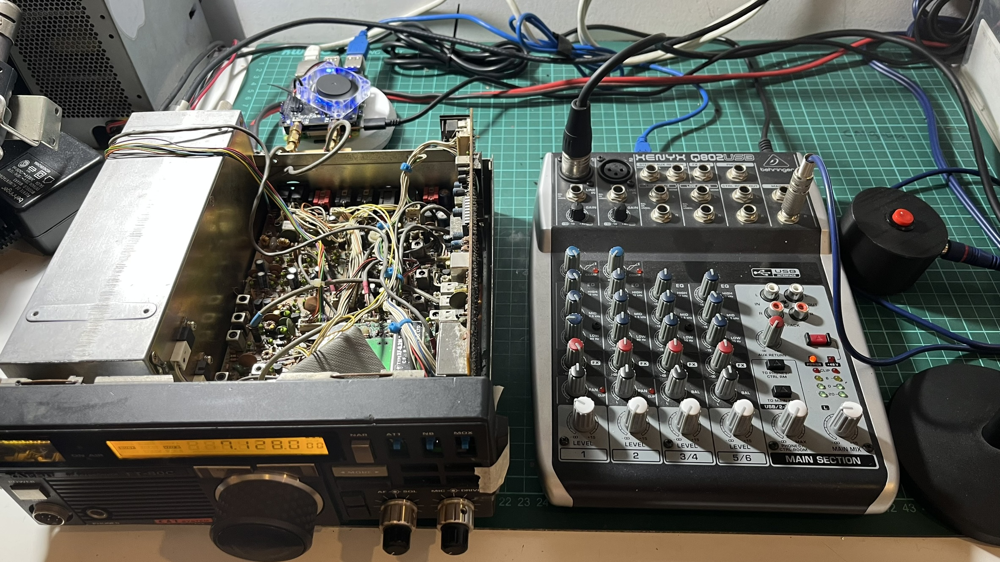](../assets/images/radioberry-ft80c-1/ft80c-with-mixer.jpeg){:target="_blank"}

## MIDI Controller for the front panel

The FT-80C front panel has 15 buttons, 3 potentiometers, and a rotary encoder for tuning. I needed a way to interface all of these with piHPSDR.

Fortunately, piHPSDR has excellent MIDI support. Any MIDI controller can be mapped to virtually any function in the software. This made the Raspberry Pi Pico RP2040 the obvious choice - it can easily emulate a USB MIDI device using CircuitPython.

[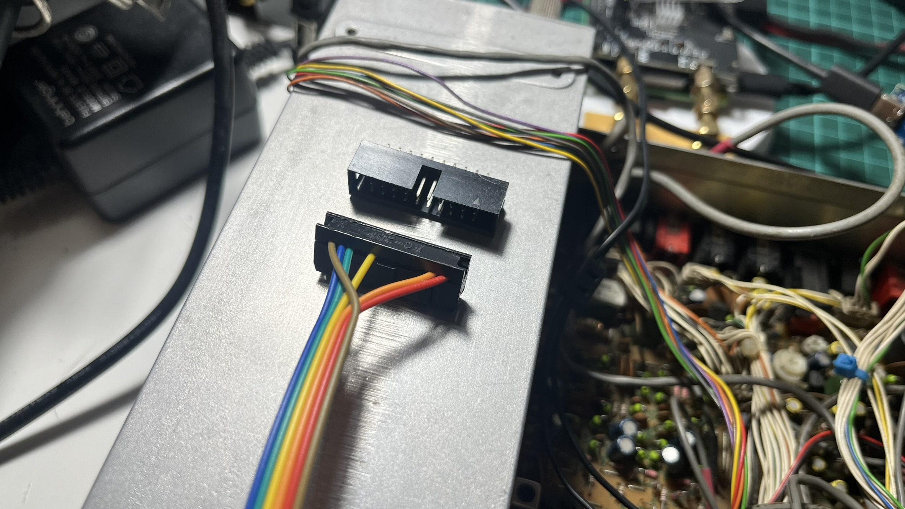](../assets/images/radioberry-ft80c-1/ft80c-buttons-panel.jpeg){:target="_blank"}

The wiring was tedious but straightforward. Each button connects between a GPIO pin and ground, using the Pico's internal pull-up resistors. When you press a button, the pin goes low, and the code sends a MIDI Note On message. Release the button, Note Off.

I used a 20-pin IDC connector to interface with the Pico. This way, I don't have to solder directly onto the board every time I need to make changes - just crimp a new ribbon cable. It also means I can swap out the Pico without desoldering anything if something goes wrong.

### Button mapping

| Button        | GPIO | MIDI Note | piHPSDR Function |
| ------------- | ---- | --------- | ---------------- |
| NARROW        | GP0  | 1         | Filter width     |
| ATT           | GP1  | 2         | Attenuator       |
| NOISE BLANKER | GP2  | 3         | NB toggle        |
| MODE <        | GP15 | 4         | Mode down        |
| MODE >        | GP16 | 5         | Mode up          |
| VFO > M       | GP5  | 6         | VFO to Memory    |
| M > VFO       | GP6  | 7         | Memory to VFO    |
| VFO           | GP7  | 8         | VFO select       |
| MR            | GP8  | 9         | Memory recall    |
| SPLIT         | GP9  | 10        | Split mode       |
| PRI-M         | GP10 | 11        | Priority memory  |
| FAST          | GP11 | 12        | Fast tuning      |
| BAND          | GP12 | 13        | Band change      |
| CLAR          | GP13 | 14        | Clarifier        |
| D LOCK        | GP14 | 15        | Dial lock        |

The three potentiometers (SQL, MIC gain, DRIVE) connect to the Pico's ADC pins and send MIDI Control Change messages. I added some filtering in the software to prevent noise from generating spurious MIDI events - a threshold of about 512 ADC units works well.

The VFO encoder was interesting. The original encoder still worked perfectly after 35 years, so I just wired it to GP3 and GP4. The code sends relative MIDI CC values: 63 for counter-clockwise, 65 for clockwise. piHPSDR interprets these as tuning commands.

[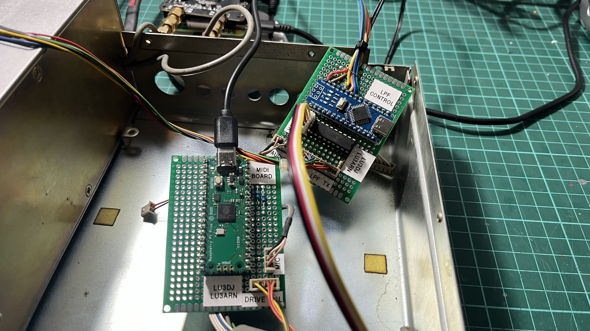](../assets/images/radioberry-ft80c-1/midi-lpf-boards-mounted.jpeg){:target="_blank"}

With the LPF and MIDI controllers done, the radio was starting to feel alive. You could change bands, tune around, switch modes - all using the original knobs and buttons. But the display was still dark.

## LCD Controller

This is where I fell into a rabbit hole. The FT-80C uses a custom LCD display (FTD8627PZ) driven by a Mitsubishi [M50932](../assets/files/radioberry-ft80c-1/M50930.pdf) microcontroller with integrated LCD driver. There's essentially no documentation available for this display - it's a Yaesu proprietary part.

[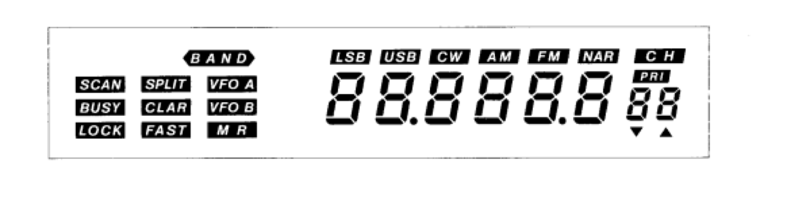](../assets/images/radioberry-ft80c-1/lcd-segments-diagram.png){:target="_blank"}

The display shows frequency (7 digits), operating mode (LSB, USB, CW, AM, FM), and various indicators (VFO A/B, SPLIT, LOCK, etc.). I really wanted to keep using it - replacing it with a generic LCD would have ruined the look of the radio.

Before diving into the hardware, I had to understand how these multiplexed LCD displays actually work. Unlike LEDs, which you can just drive with DC, LCD segments need to be driven with AC signals. If you apply a constant DC voltage to an LCD segment, the liquid crystals will eventually degrade, permanently damaging the display. The controller has to continuously alternate the voltage polarity on each segment, typically at 30-60Hz. This is why you can't just "turn on" a segment with a GPIO pin - you need a proper LCD driver that handles the AC waveform generation.

### Reverse engineering the original controller

The first step was understanding how the M50932 drives the display. I connected an oscilloscope to the COM and SEG lines. In contrast, the original board was still connected (powered by a bench supply).

[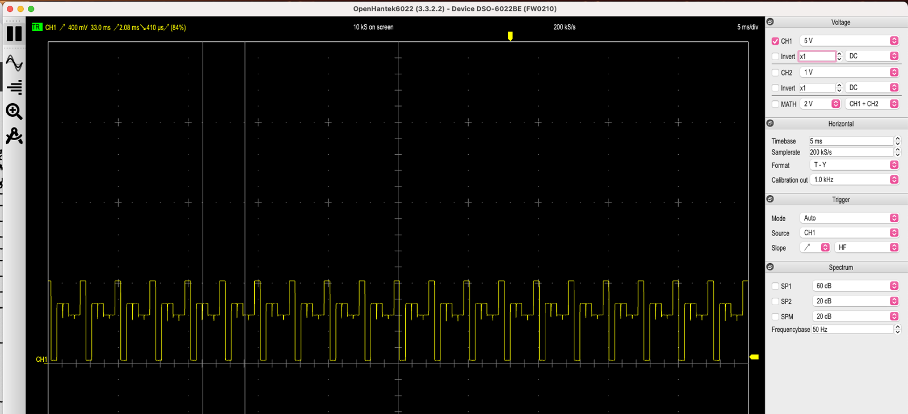](../assets/images/radioberry-ft80c-1/oscilloscope-m50932.png){:target="_blank"}

The captures told me what I needed to know:
- **Bias**: 1/3 (three voltage levels visible in the waveform)
- **Duty cycle**: 1/3 (using 3 COM lines)
- **Frame rate**: approximately 30Hz

Armed with this information, I set out to find a replacement LCD driver that met these parameters.

### Finding the HT1621B

After some research, I found the [HT1621B](../assets/files/radioberry-ft80c-1/ht1621b.PDF) from Holtek. It's a RAM-mapped LCD driver with a serial interface, capable of driving up to 32 segments x 4 commons. The specs matched my requirements almost perfectly:

| Parameter | M50932 Original | HT1621B | Our Display |
| --------- | --------------- | ------- | ----------- |
| COM lines | 4               | 4       | 3 used      |
| SEG lines | 32              | 32      | 32          |
| Bias      | 1/3 supported   | 1/3     | 1/3         |
| Duty      | 1/3 supported   | 1/3     | 1/3         |

I ordered some HT1621B chips and breakout boards from AliExpress. A few days later, I was ready to test.

[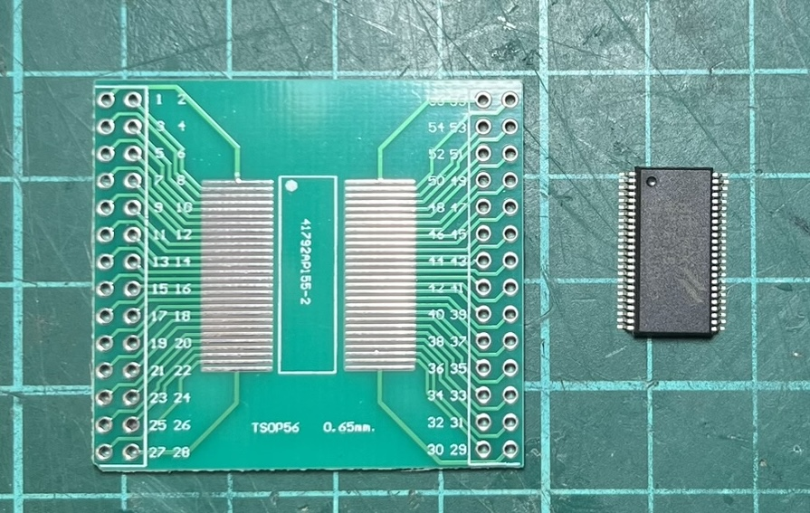](../assets/images/radioberry-ft80c-1/ht1621b-breakout.jpeg){:target="_blank"}

Unfortunately, the breakout boards turned out to be 0.65mm pitch instead of the 0.635mm the chip expects. Close enough to work, but I had to carefully bend the pins on each chip to make them fit.

[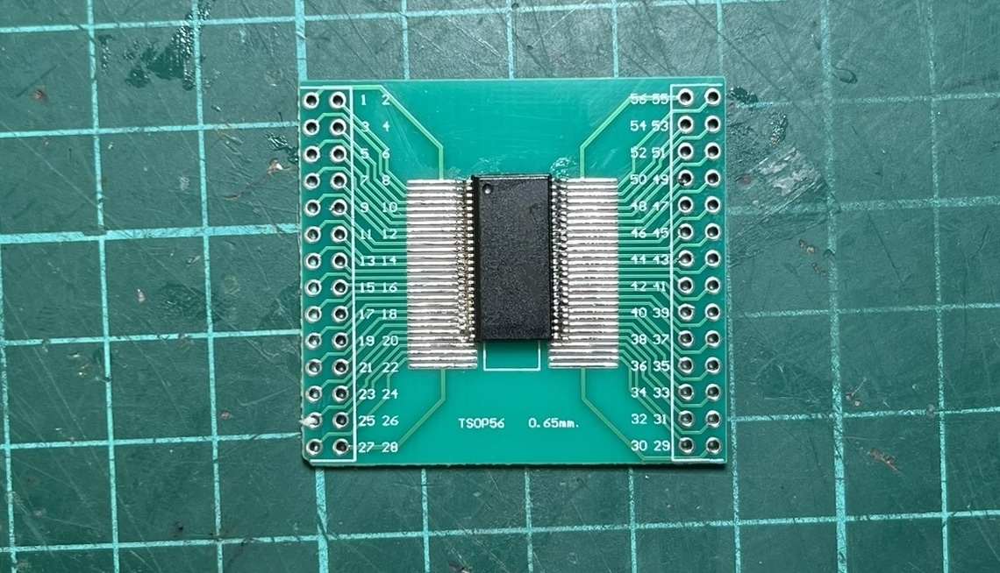](../assets/images/radioberry-ft80c-1/ht1621b-breakout-soldered.jpeg){:target="_blank"}

The first test was simple: configure the HT1621B with the same parameters as the original controller and see if I got similar waveforms. I did.

[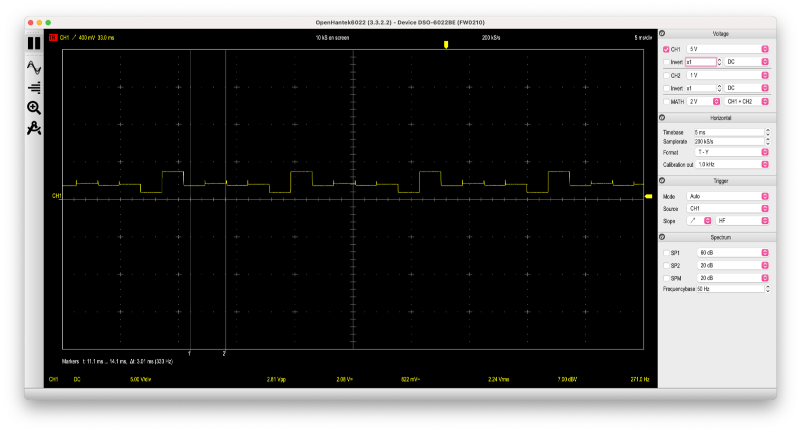](../assets/images/radioberry-ft80c-1/oscilloscope-ht1621b.png){:target="_blank"}

The waveforms matched, but would it actually drive the display? I connected just COM0 and a single segment line to find out. When that first segment lit up on a display that hadn't shown anything in days, I knew the approach would work.

[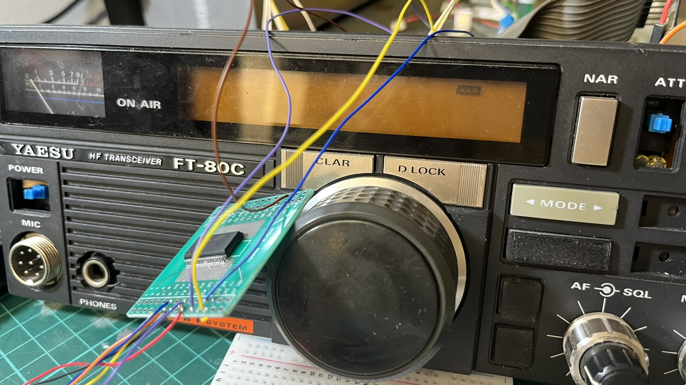](../assets/images/radioberry-ft80c-1/ft80c-lcd-cables-test.jpeg){:target="_blank"}

### Wiring 35 connections

The LCD has 32 segment lines plus 3 COM lines. I had to physically disconnect the M50932 from the display (isolating its outputs to prevent interference) and run 35 wires to the HT1621B.

To keep things organized, I used color-coded wires:

| Color  | Connections      | Count |
| ------ | ---------------- | ----- |
| Orange | COM0, COM1, COM2 | 3     |
| Red    | SEG0 - SEG5      | 6     |
| Brown  | SEG6 - SEG11     | 6     |
| Blue   | SEG12 - SEG17    | 6     |
| Green  | SEG18 - SEG23    | 6     |
| Purple | SEG24 - SEG29    | 6     |
| Yellow | SEG30, SEG31     | 2     |

[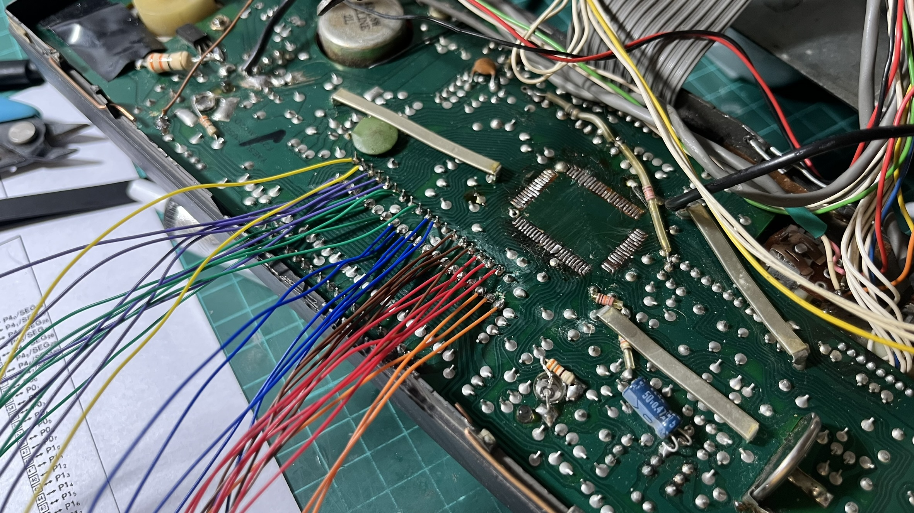](../assets/images/radioberry-ft80c-1/lcd-wiring-colors.jpeg){:target="_blank"}

The soldering took a couple of hours. The connections on the display side are tiny surface-mount pads, and one wrong move could rip a trace.

### Mapping 128 segments

With the hardware connected, I still had to figure out which segment address controlled which part of the display. The HT1621B has 32 addresses, each controlling 4 bits (one per COM line), for a total of 128 possible segments.

I wrote a [test program](https://github.com/reynico/radioberry-setup/tree/main/lcd-controller-ft-80c/ht1621b_test) that cycles through each segment one at a time, lighting it up for a couple of seconds while I noted down what it controlled. This mapping process took an entire afternoon. Address 7, bit 2 is segment A of digit 7. Address 29, bit 1 is the BUSY indicator. Address 21, bit 2 is the LSB mode indicator. And so on, 128 times.

[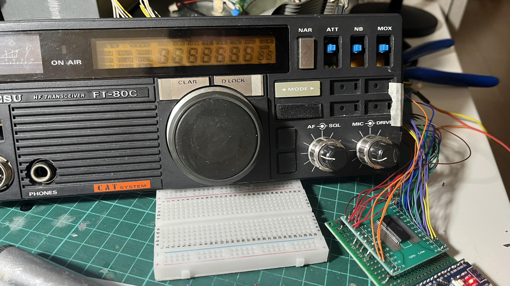](../assets/images/radioberry-ft80c-1/lcd-all-segments-test.jpeg){:target="_blank"}

The result was a complete segment map that I encoded into a header file. Now I could display any frequency or indicator combination.

### Connecting to piHPSDR

The Arduino running the HT1621B code receives commands via serial from a Python bridge script on the Raspberry Pi. The bridge polls piHPSDR's rigctl interface (port 19090) for frequency, mode, and S-meter readings, then forwards them to the Arduino using Kenwood CAT protocol.

```
piHPSDR --> lcd_bridge.py --> Arduino --> HT1621B --> LCD Display
```

The first time I saw the frequency update on the original LCD as I tuned in piHPSDR, I just stared at it for a while. After all that work mapping segments, seeing "7.109.0" appear on a display that hadn't shown anything in years was genuinely exciting.

[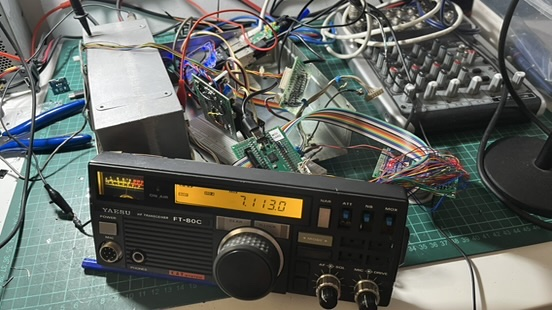](../assets/images/radioberry-ft80c-1/lcd-frequency-working.jpeg){:target="_blank"}

I added a startup sequence that displays my callsign, "LU3Arn," with all indicators lit. It's a nice visual confirmation that the LCD controller is working before piHPSDR connects.

[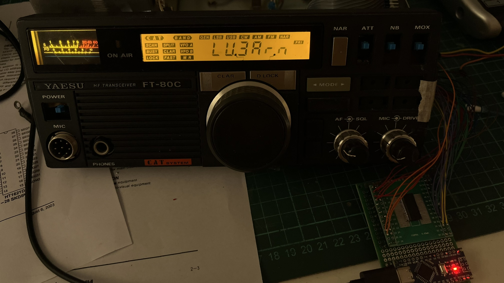](../assets/images/radioberry-ft80c-1/lcd-callsign-lu3arn.jpeg){:target="_blank"}

### S-meter

The original FT-80C has an analog S-meter that I wanted to keep functional. The Arduino outputs a PWM signal on pin D3 based on the signal strength readings from piHPSDR. A simple RC low-pass filter (23k resistor + 10uF capacitor) converts the PWM to a smooth DC voltage that drives the meter movement. The time constant of about 230ms is slow enough to filter the PWM ripple but fast enough to follow signal changes.

The bridge script reads the S-meter value in dB from piHPSDR via CAT, scales it to 0-255, and sends it to the Arduino via the `SM` command.

[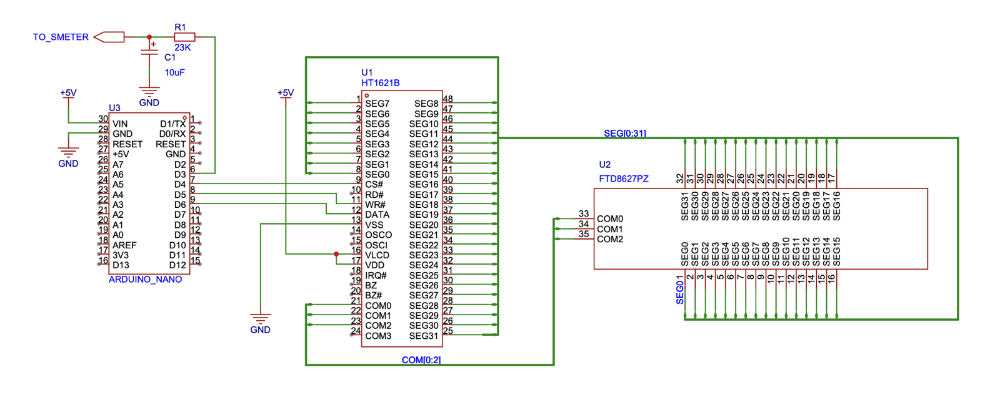](../assets/images/radioberry-ft80c-1/lcd-controller-schematic.png){:target="_blank"}

[](../assets/images/radioberry-ft80c-1/ft80c-front-working.jpeg){:target="_blank"}

## Power Supply and Soft Shutdown

The last piece of the puzzle handles power regulation and graceful shutdown. The Raspberry Pi needs clean 5V, and the FT-80C doesn't have an internal power supply - it runs from an external 13.8V source. I can't just cut power abruptly without risking SD card corruption.

### Voltage regulation

I could have used a high-efficiency switching regulator, but I'm always paranoid about introducing noise into the system. On HF, switching noise can really mess with your signal - you'll hear it as a constant buzzing or whine across the band. So I went with a less efficient but quieter approach: a linear regulator with a TIP3055 pass transistor mounted on the chassis as a heatsink. It wastes more power as heat, but I know for sure I won't have electrical noise problems.

[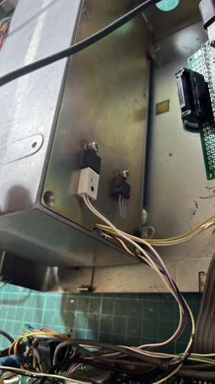](../assets/images/radioberry-ft80c-1/voltage-regulator.jpeg){:target="_blank"}

### Soft shutdown circuit

The shutdown circuit uses an OR gate to control a power relay. One input comes from a front panel switch (directly wired to GPIO4), the other from GPIO14 on the Raspberry Pi.

When you flip the power switch off:
1. GPIO4 goes low, triggering a shutdown script
2. The script runs `poweroff` and waits
3. When the Pi is fully off, GPIO14 goes low
4. Both OR gate inputs are now low, opening the relay
5. A large capacitor (4700uF) creates a slight delay before power cuts completely

This gives the system about 10-15 seconds for a clean shutdown. No more corrupted SD cards from impatient power cycling.

At this point, I had all the boards working, but they were just sitting loose inside the chassis, held in place with tape and hope. Not exactly a permanent solution.

[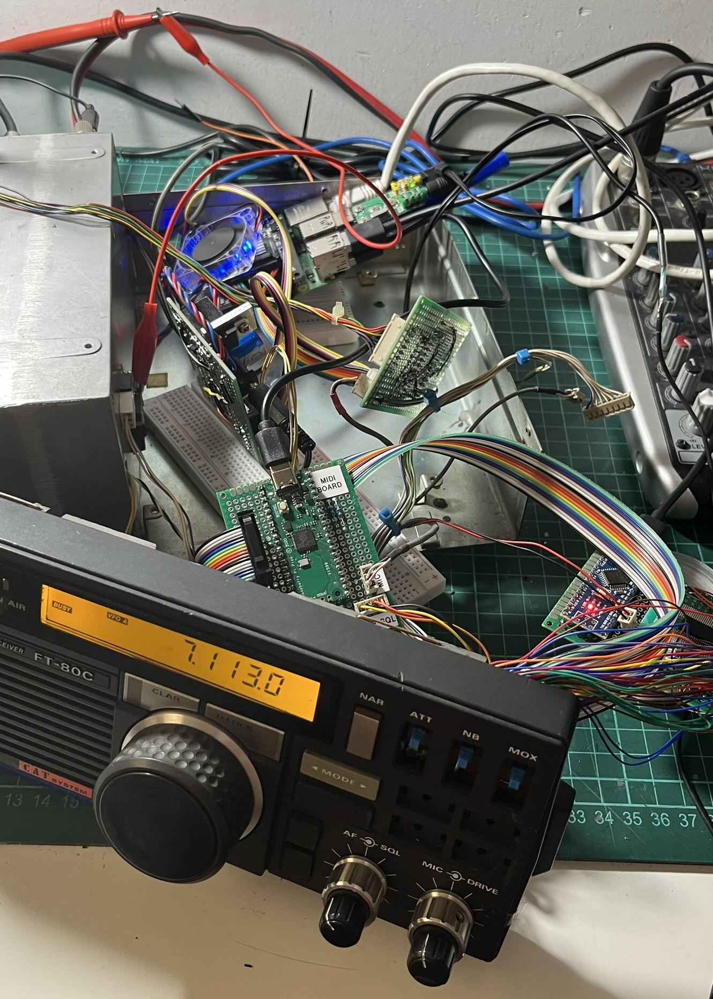](../assets/images/radioberry-ft80c-1/ft80c-messy-progress.jpeg){:target="_blank"}

### Mounting everything

I designed a 3D-printed board with the exact same dimensions and mounting holes as the original main board. This way it fits perfectly in the chassis using the existing standoffs. I added threaded inserts to mount the Raspberry Pi and all the control boards, making good use of the space left by the removed main board.

[](../assets/images/radioberry-ft80c-1/3d-printed-mainboard-mount.jpeg){:target="_blank"}

The Raspberry Pi sits on this board with the RadioBerry HAT on top.

[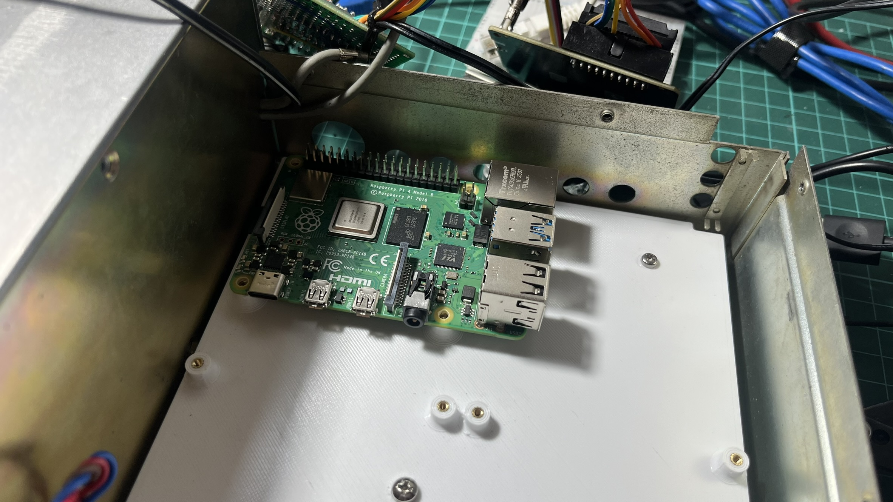](../assets/images/radioberry-ft80c-1/rpi-mounted-detail.jpeg){:target="_blank"}

The RadioBerry needs good airflow to keep the FPGA cool during TX. I printed a small bracket to hold a 40mm fan, with a cutout for the SMA connector that goes to the PA board.

[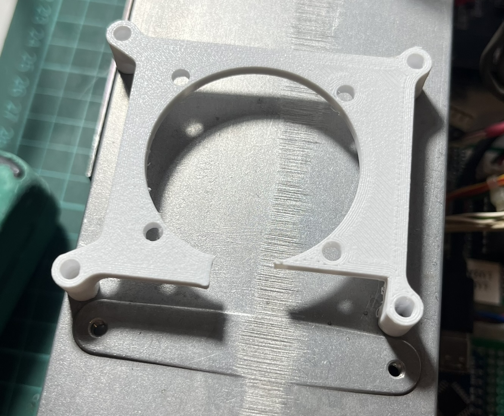](../assets/images/radioberry-ft80c-1/fan-mount-radioberry-connector.jpeg){:target="_blank"}

## Putting it all together

With all the boards complete, I spent an afternoon routing cables and finding homes for everything inside the chassis. The four boards - LPF control, MIDI controller, LCD driver, and power supply - all mount on the 3D printed bracket.

[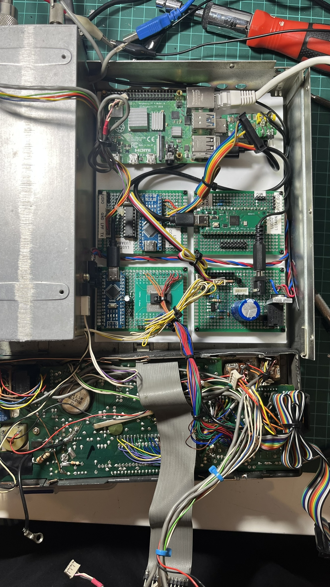](../assets/images/radioberry-ft80c-1/boards-mounted-on-3d-print.jpeg){:target="_blank"}

It's not the neatest installation - there are a lot of wires - but it all fits.

[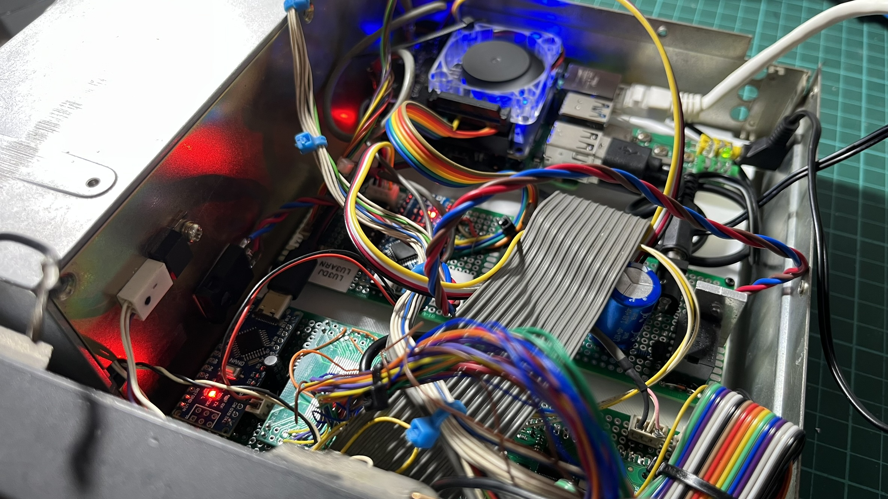](../assets/images/radioberry-ft80c-1/interior-with-leds.jpeg){:target="_blank"}

The RadioBerry's blue LED glows through the top vent, and you can see status LEDs from the Arduino boards if you look closely. The original cooling fan still works, keeping everything at reasonable temperatures.

Testing with piHPSDR confirmed that everything worked together: filter switching, PTT, all the buttons, the encoder, the LCD, and even the S-meter (which is driven by PWM from the LCD controller Arduino based on signal strength readings from piHPSDR).

[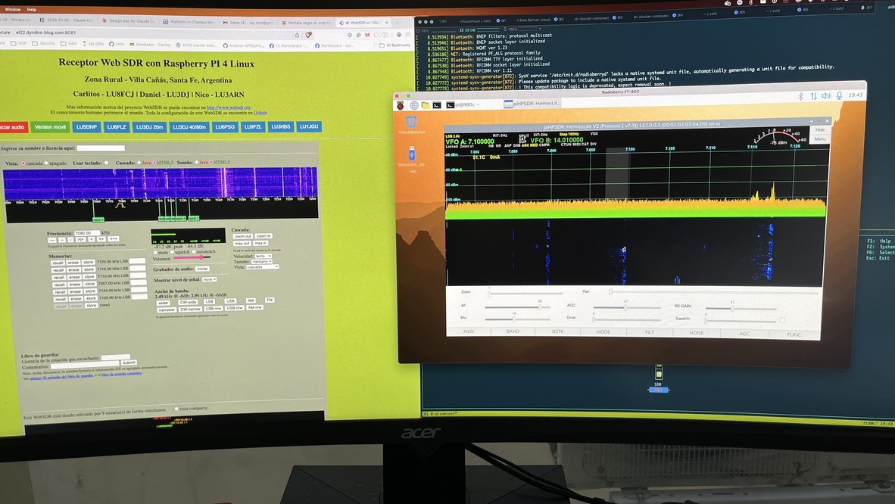](../assets/images/radioberry-ft80c-1/pihpsdr-websdr-test.jpeg){:target="_blank"}

After several iterations of cable management, this is how it looks from above. All four boards are visible, cables are routed cleanly, and everything is secured in place.

[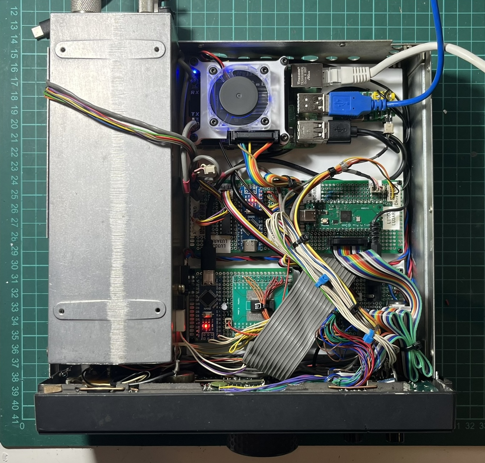](../assets/images/radioberry-ft80c-1/ft80c-top-view-final.jpeg){:target="_blank"}

The radio now boots up, displays our callsign while piHPSDR loads, then shows the current frequency and mode. All the original controls work. From the outside, it looks almost identical to how it did in 1988.

[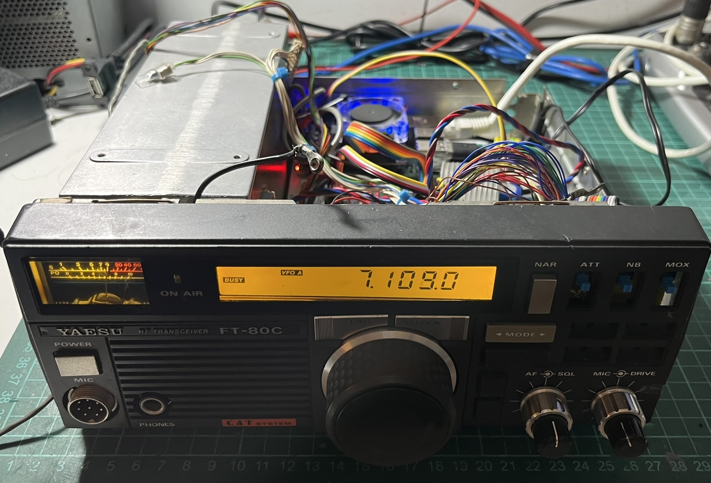](../assets/images/radioberry-ft80c-1/ft80c-angle-working.jpeg){:target="_blank"}

Tuned to 40 meters and receiving properly - the LCD showing frequency, the S-meter responding to signals.

[](../assets/images/radioberry-ft80c-1/ft80c-tuning-working.jpeg){:target="_blank"}

## 3D Printed Front Panel Buttons

Since I repurposed the front panel buttons to work with piHPSDR and the RadioBerry, their original functions no longer matched what they actually did. I remapped them to functions that made more sense for this setup.

Fortunately, [Matías - LU4BA](https://www.qrz.com/db/LU4BA) had shared [STL files for FT-80C buttons on Thingiverse](https://www.thingiverse.com/thing:6796234), which gave me a starting point. I went through several iterations trying to get them right.

[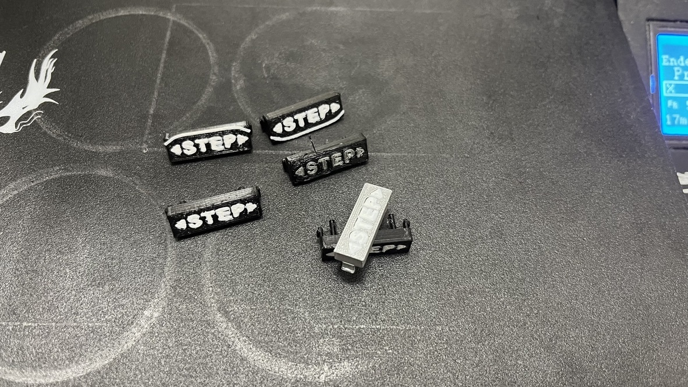](../assets/images/radioberry-ft80c-1/buttons_several_tests.jpeg){:target="_blank"}

The main challenge was finding the right combination of material, layer height, and print orientation. Some came out too brittle, others didn't fit the switches properly, and a few just looked wrong. After probably 8-10 test prints, I settled on a configuration that worked. Text were printed with 110% flow, and with a babystep-z of -0.1000.

[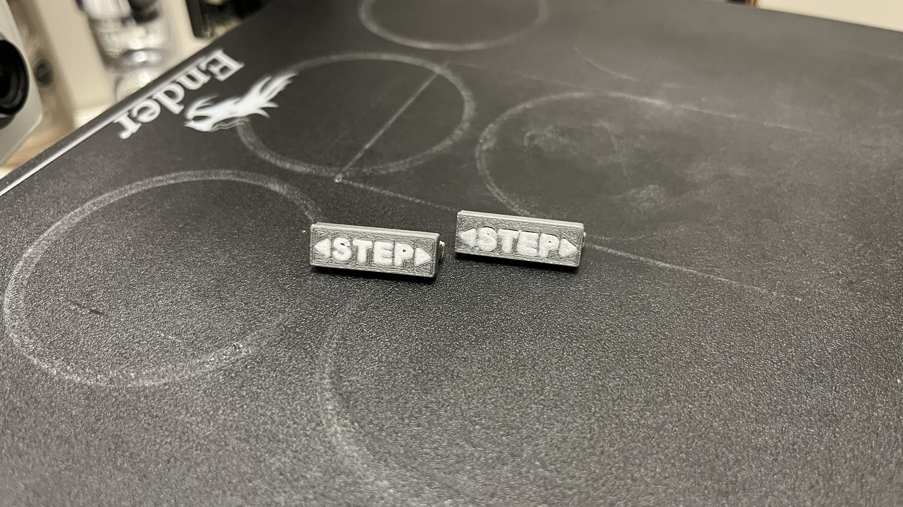](../assets/images/radioberry-ft80c-1/buttons_final_style.jpeg){:target="_blank"}

The final buttons are printed in PLA with 0.15mm layer height. I added text labels by pausing the print mid-layer and swapping to a different color filament for the lettering - a technique called filament swap.

[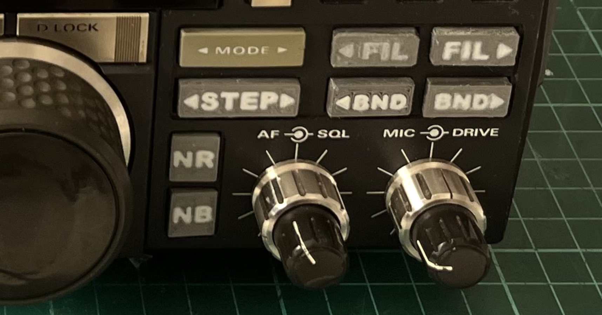](../assets/images/radioberry-ft80c-1/installed_buttons.png){:target="_blank"}

They're installed and functional now. I'm not 100% convinced about how they look - the originals had better texture and feel - but they work, and they're definitely an improvement over missing buttons. The STL files I used are available in the [GitHub repository](https://github.com/reynico/radioberry-setup/tree/main/3d-printed-parts-ft-80c).

## The 7" LCD Display Challenge

A few days after finishing the main build, the [Hosyond 7" touchscreen](https://www.amazon.com/dp/B0D3QB7X4Z) I had ordered finally arrived. The plan was to mount it on top of the radio to run piHPSDR's interface, giving me full control without needing an external monitor.

[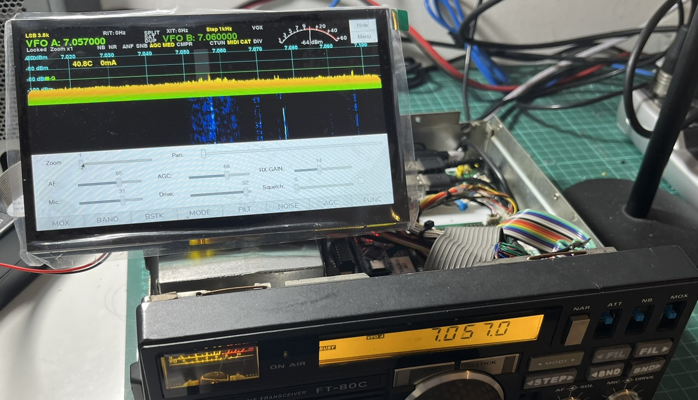](../assets/images/radioberry-ft80c-1/lcd-screen-connected-pi4.jpeg){:target="_blank"}

The screen worked perfectly when connected directly to the Raspberry Pi. The problem became apparent when I tried to figure out where to mount it: the included flex cable was way too short to route from the Pi inside the chassis to a display mounted on top of the radio.

I remembered I had bought some 30cm flex cable extensions a while back for another project. Perfect - or so I thought. I connected one extension, powered everything up, and the screen stayed dark. No backlight, no image, nothing.

After some head-scratching and multimeter probing, I figured out the issue: the flex cable extensions I had were straight-through cables (pin 1 to pin 1, pin 2 to pin 2, and so on), but the Hosyond display needed a crossover cable where the pins are reversed.

The solution was simple in theory but tedious in practice: I could chain two straight-through extensions together. The first one would flip the pins, the second one would flip them back, resulting in a crossover connection. This would give me a 60cm extension - more than enough length to route from the Pi to the top of the radio.

[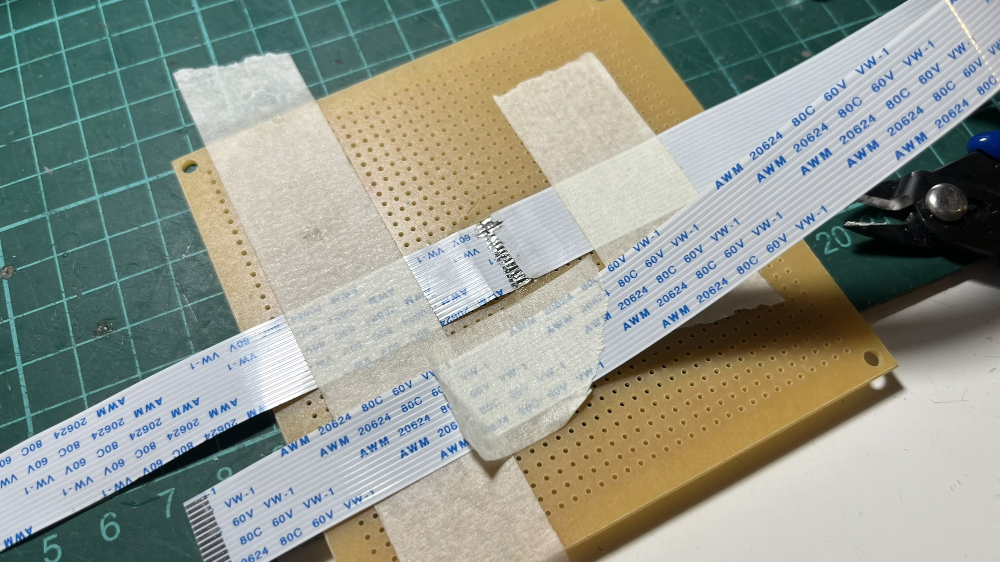](../assets/images/radioberry-ft80c-1/lcd-screen-flex-build.jpeg){:target="_blank"}

I carefully soldered the two 30cm extensions end-to-end, ensuring the connections were clean and the wiring neat. Flex cables are delicate, and a single cold-solder joint would mean redoing the whole thing.

[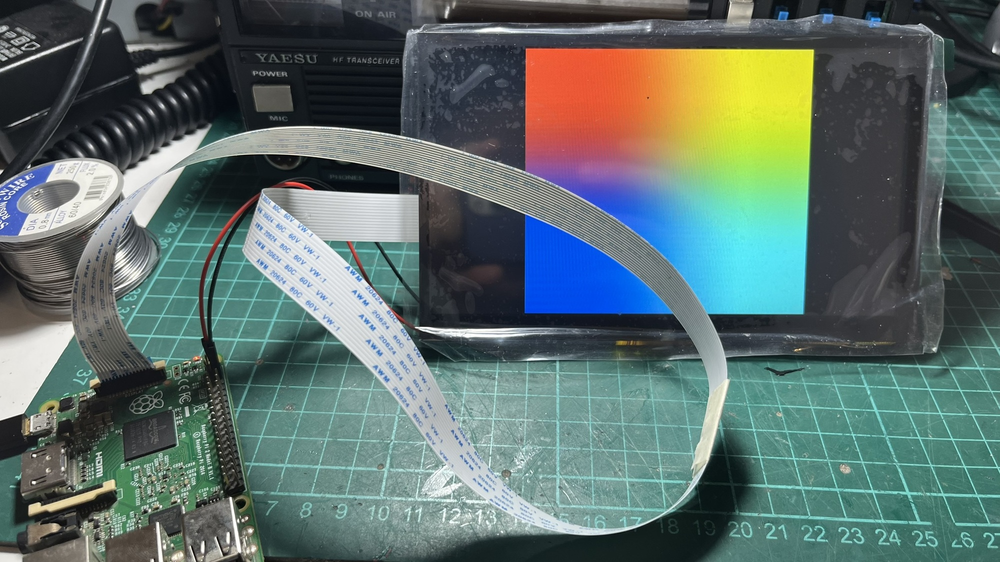](../assets/images/radioberry-ft80c-1/lcd-screen-test-flex.jpeg){:target="_blank"}

The first test was nerve-wracking. I connected everything, powered on, and the screen lit up immediately. Success.

[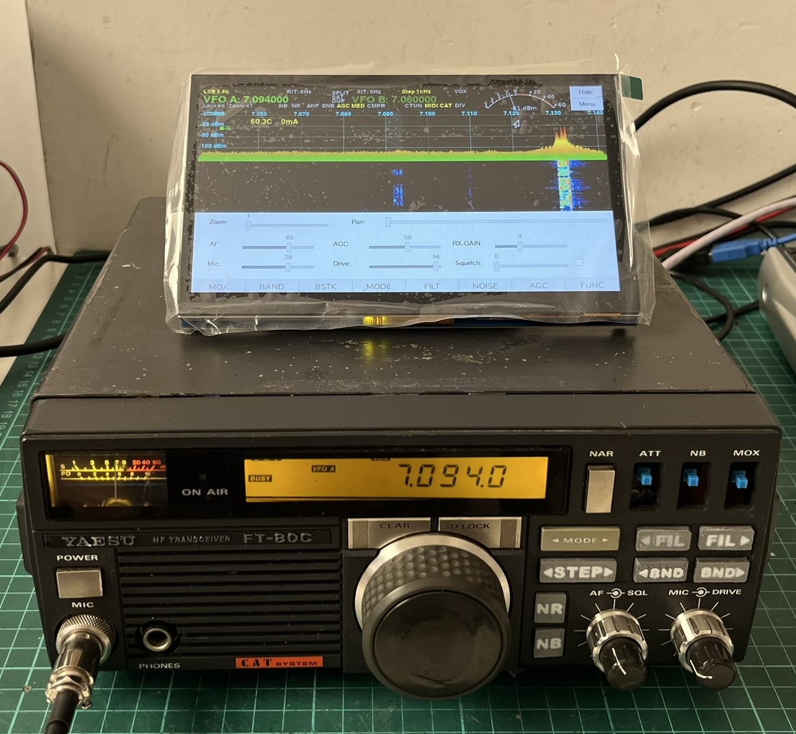](../assets/images/radioberry-ft80c-1/lcd-screen-working-pihpsdr.jpeg){:target="_blank"}

With piHPSDR running on the touchscreen, the radio finally feels complete. I can tune, switch modes, adjust settings, and view the waterfall - all without touching a keyboard or an external monitor.

Now I just needed a proper way to mount the screen on top of the radio. Just laying it flat would work, but it wouldn't be comfortable to use. I wanted it angled, like a display you'd actually want to interact with.

I designed a simple mounting bracket in 3D with two legs that sit on top of the FT-80C chassis. The design holds the screen at a comfortable viewing angle - not too steep, not too flat. The bracket is essentially a box that the screen slides into, with cutouts for the cables and mounting holes to secure everything.

[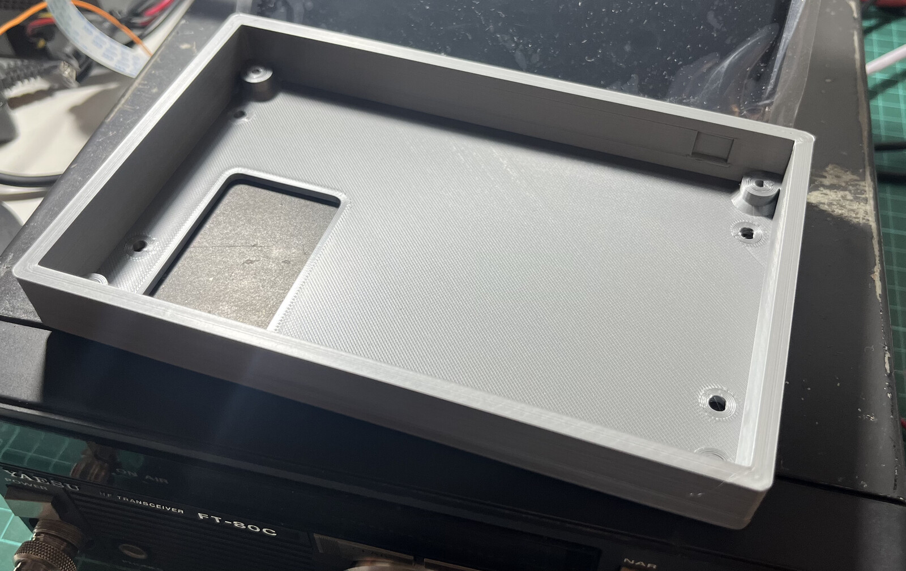](../assets/images/radioberry-ft80c-1/lcd-box.jpg){:target="_blank"}

Once the print was done, I mounted the screen into the bracket. The fit was tight enough that it doesn't move around, but I can still remove it if needed.

[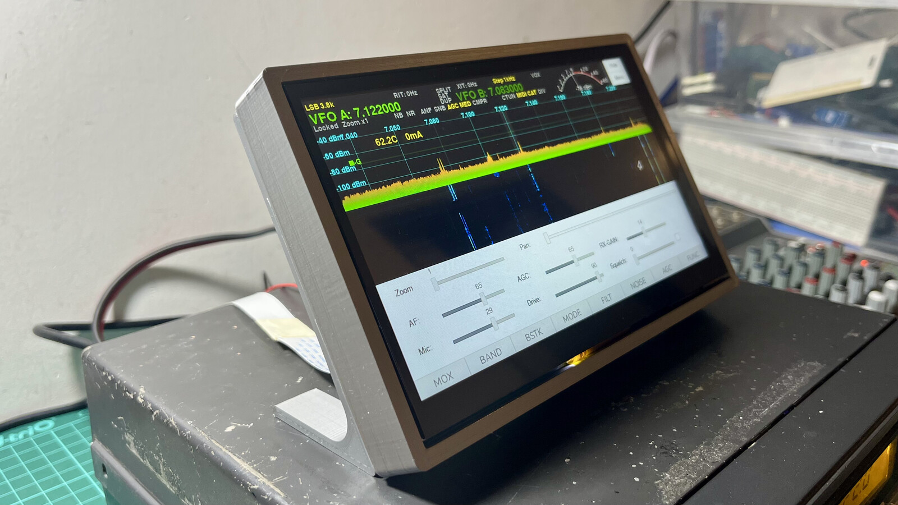](../assets/images/radioberry-ft80c-1/lcd-box-mounted.jpg){:target="_blank"}

The final result sits nicely on top of the radio. The angle makes it easy to see and use the touchscreen without hunching over. The flex cable routes cleanly from inside the chassis up to the display.

[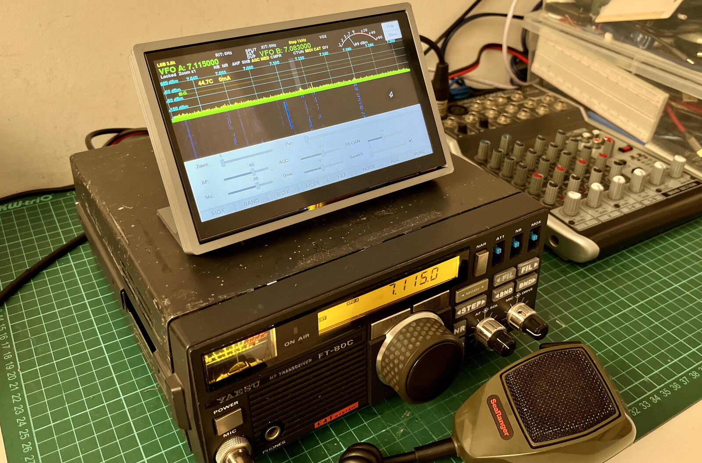](../assets/images/radioberry-ft80c-1/lcd-box-mounted-final.jpg){:target="_blank"}

The [STL files for the mounting bracket](https://github.com/reynico/radioberry-setup/tree/main/3d-printed-parts-ft-80c) are available in the GitHub repository if you want to print your own.

## Frequency calibration: from Hz to PPM

Once the radio was working, I noticed that the frequency wasn't perfectly aligned. I had already seen this with the [Vertex VX1700 build](), but back then we were mostly operating on 40 meters so it wasn't a big deal. With the FT-80C I wanted to use multiple bands, and the issue became impossible to ignore.

piHPSDR has a [Frequency Calibration](https://apache-labs.com/public/storage/download_file/1756364890_1021_piHPSDR-Manual-3.pdf#page=43) feature under Radio > Frequency Calibration, but it works by adding a fixed Hz offset to all frequencies. The problem with this approach is that crystal oscillator errors are proportional to frequency - if I calibrated the offset for 7 MHz (40 meters), by the time I tuned to 28 MHz (10 meters), the error was four times larger and the frequency was visibly off.

I focused on 40 meters and 10 meters for calibration because, with my novice license, those are the only bands I'm allowed to transmit on. All testing was done into a dummy load to avoid transmitting on the air during the process.

To have a reliable reference signal, I used a second FT-80C (an original, unmodified one that I know is properly calibrated) transmitting into the dummy load at 7.060 MHz and 28.5 MHz. On the receiving side, I also verified the readings with an RTL-SDR v3 dongle that I had previously confirmed was frequency-accurate. So the calibration process involved three devices: the original FT-80C as a TX reference, the RTL-SDR as an independent RX reference, and the RadioBerry itself in both RX and TX modes. Not laboratory-grade equipment by any means, but reasonable enough for a home setup.

[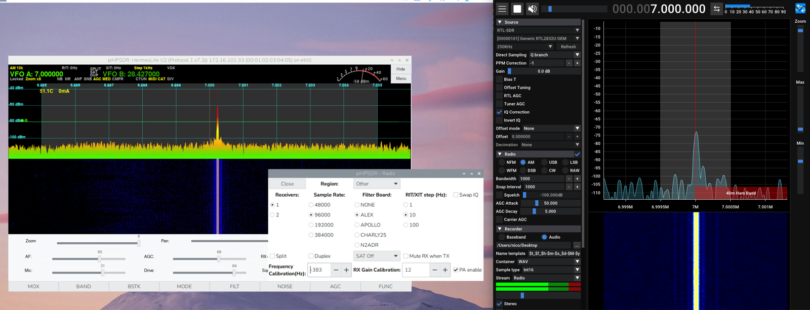](../assets/images/radioberry-ft80c-1/40m-freq-cal-hz-rx-centered.png){:target="_blank"}

Here I had 40 meters calibrated with a fixed Hz offset, and the signal looked perfectly centered. But when I switched to 10 meters without changing the calibration value, this happened:

[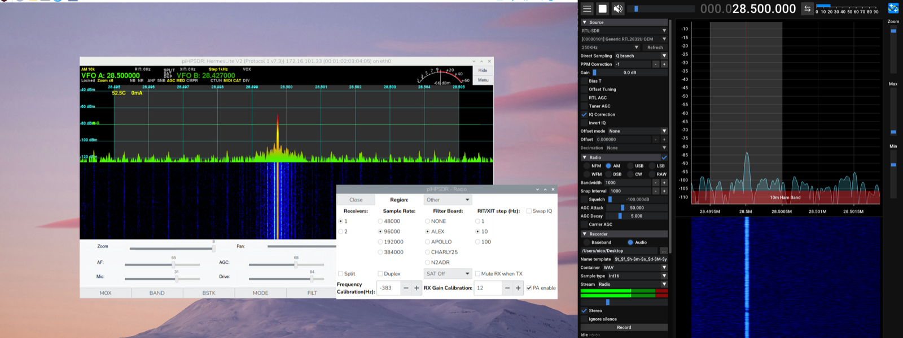](../assets/images/radioberry-ft80c-1/10m-freq-cal-hz-rx-off.png){:target="_blank"}

The signal was clearly shifted. I could re-adjust the Hz offset to center it on 10 meters, but then 40 meters would be off again. You can't win with a fixed offset.

[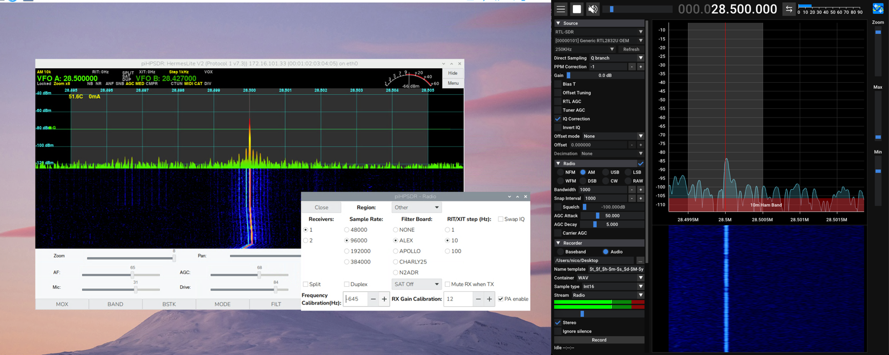](../assets/images/radioberry-ft80c-1/10m-freq-cal-hz-rx-centered.png){:target="_blank"}

The correct way to handle this is with parts-per-million (PPM) calibration. Instead of adding a fixed number of Hz, you express the oscillator error as a ratio. A single PPM value scales proportionally with frequency - the correction at 28 MHz is automatically four times larger than at 7 MHz, matching the actual behavior of the oscillator error.

I [opened an issue](https://github.com/g0orx/pihpsdr/issues/202) on the piHPSDR repository and then submitted a [pull request](https://github.com/g0orx/pihpsdr/pull/205) implementing the change. The modification was small - about 22 lines added and 15 removed across 5 files. The core of it is a function that applies the PPM correction:

```c
static inline long long freq_with_calibration(long long freq) {
  return freq + (long long)round((double)freq *
         calibration_ppm / 1e6);
}
```

The old code simply added `calibration` (in Hz) to every frequency. The new code multiplies the frequency by the PPM value divided by one million, producing a proportional correction that scales correctly across all bands.

[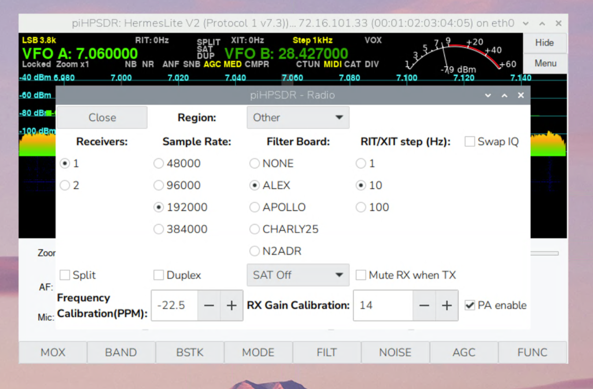](../assets/images/radioberry-ft80c-1/freq-cal-ppm-menu.png){:target="_blank"}

With the PPM calibration in place, I set the value to -22.5 PPM and both bands were properly aligned with a single setting:

[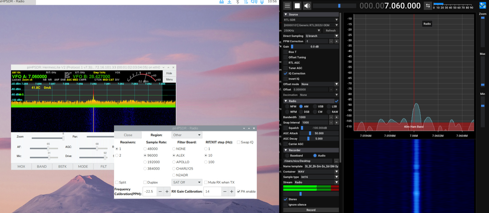](../assets/images/radioberry-ft80c-1/40m-freq-cal-ppm-rx-centered.png){:target="_blank"}

[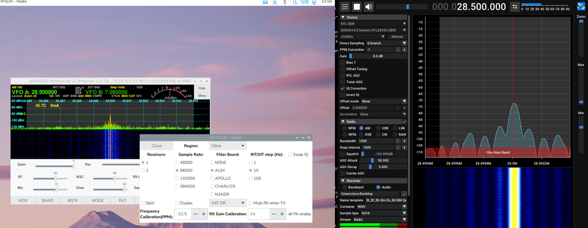](../assets/images/radioberry-ft80c-1/10m-freq-cal-ppm-rx-centered.png){:target="_blank"}

TX also confirmed proper alignment on both bands:

[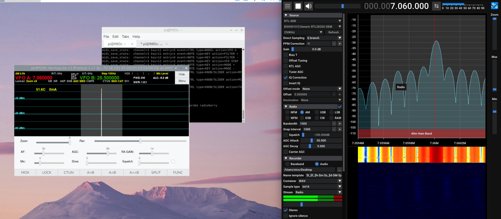](../assets/images/radioberry-ft80c-1/40m-freq-cal-ppm-tx-centered.png){:target="_blank"}

[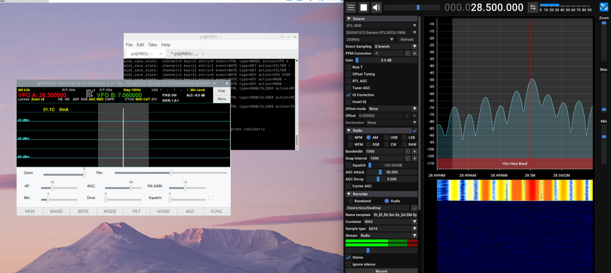](../assets/images/radioberry-ft80c-1/10m-freq-cal-ppm-tx-centered.png){:target="_blank"}

One PPM value, all bands calibrated. This is a small change, but it makes a real difference when you're operating across the HF spectrum.

## What's still missing

At this point, the radio is fully functional and ready to use. All the major components are working: the PA stage, filter switching, front panel controls, LCD display, and the touchscreen interface. I've been using it on the air and it performs well.

## Lessons learned

Compared to the VX1700 build, this one was significantly more complex. The VX1700 still had its original CPU board controlling the filters; I just had to interface with it. The FT-80C required rebuilding everything from scratch.

The modular approach (one board per function) was definitely the right call. When something didn't work, I could test each board independently. The LCD controller alone went through three revisions before I got the segment mapping right.

The most satisfying moment was when I first tuned across 40 meters and heard CW signals coming through the speaker, with the original LCD showing the frequency and the S-meter bouncing. The radio that had been sitting there unused for years was alive again.

[All code, schematics, and documentation are available in the GitHub repository](https://github.com/reynico/radioberry-setup). The LCD segment mapping alone might be useful if anyone else is trying to revive an FT-80C or FT-747GX.
