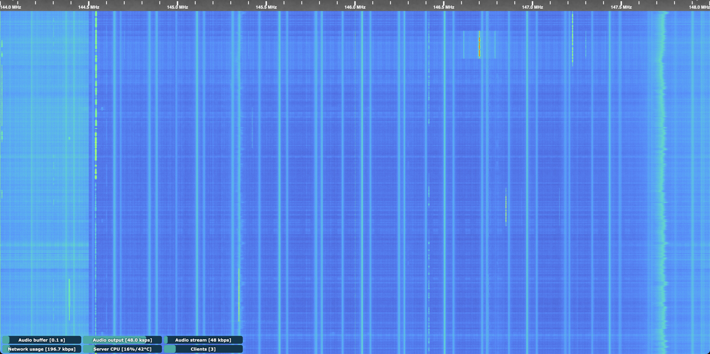
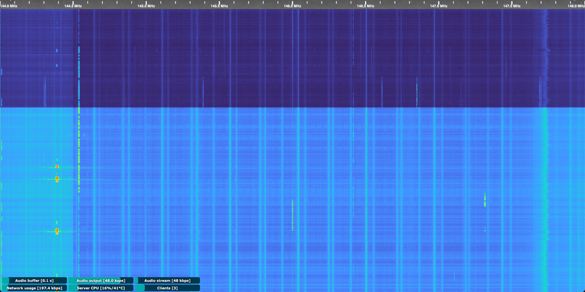
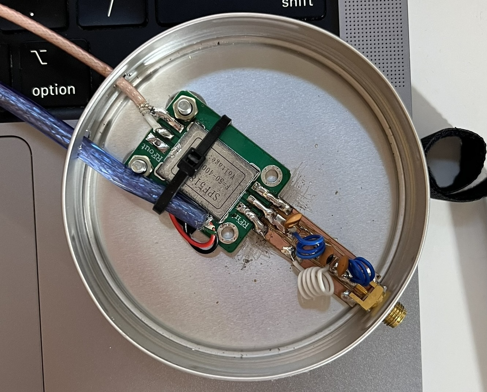
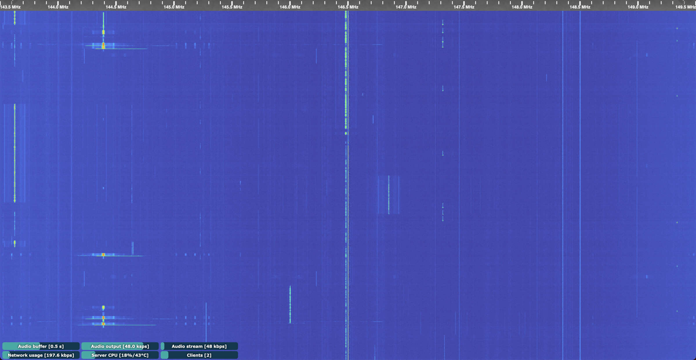

A while ago, I built and made available a [dual-band VHF/UHF OpenWebRX+ Internet SDR receiver](), [https://sdr.nico.ninja](https://sdr.nico.ninja). Time passed, and things changed. I replaced both [RTL-SDR.com](http://RTL-SDR.com) v3 SDR receivers with my old, unused HackRF One. I also decided to cover just the VHF ham radio band, from 144 to 148 MHz (and a bit more on each edge), since most hams around here are most active on the 2-meter band.

Also, with the installation of my HF shack, I moved my antennae to the building's terrace, took advantage of the space up there, and moved the SDR and antenna.

Not much surprise to me, the HackRF One is a hell of a waterfall full of noise, nevertheless I wasn't too hooked to the 2m band, so I left it as it was, noisy, but with a nice antenna deployment, 50 meters above sea level.

{:target="_blank"}

A few weeks ago, I decided to investigate further into the noisy figure of my SDR. Despite many people complaining that the HackRF board is noisy by design and prone to inducing [interference from one of the internal clocks](https://github.com/greatscottgadgets/hackrf/issues/544). Moving down the gain controls a bit didn't do much, really, as you can see in the following screenshot.

{:target="_blank"}

But I found that setting the LNA gain to 0 and adjusting the VGA gain reduced much of the internally induced noise. So I thought I could hook up an SPF5189Z LNA I had in my radio box. Coupled with the homemade FM band-stop filter, this should do a pretty good job. Even better, I also added several ferrite beads to the USB and coaxial cables.

{:target="_blank"}

And indeed that was it.

{:target="_blank"}

Although I still run the SDR with the not-so-good Flower Pot antenna, it works very well, I guess, due to the high elevation in this zone.

Next steps: replace the Flower Pot with something vertical and omnidirectional with higher gain, and modify the SPF5189Z to feed it through a bias-tee.

