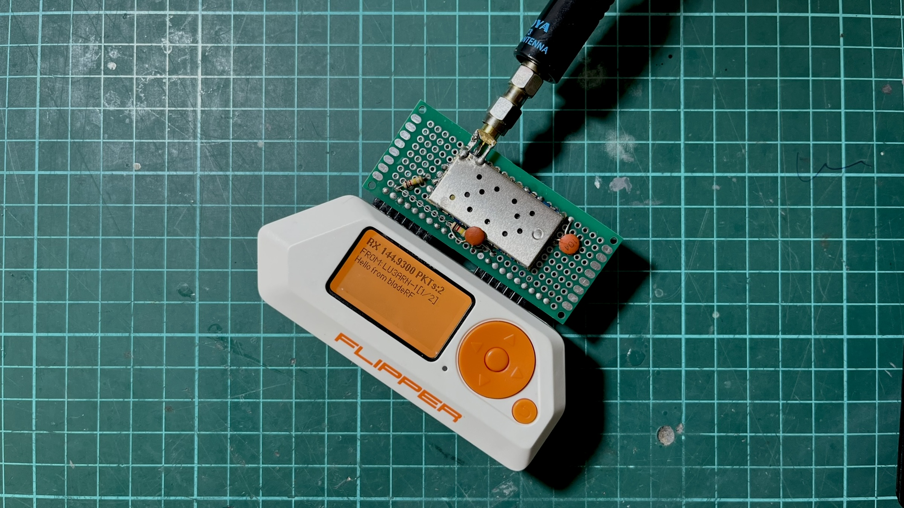
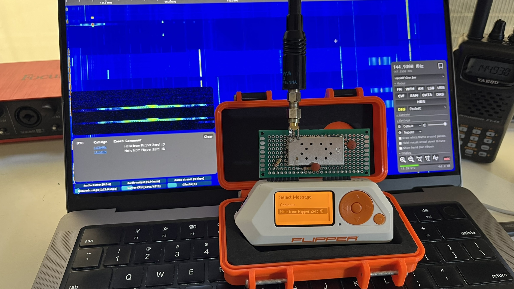
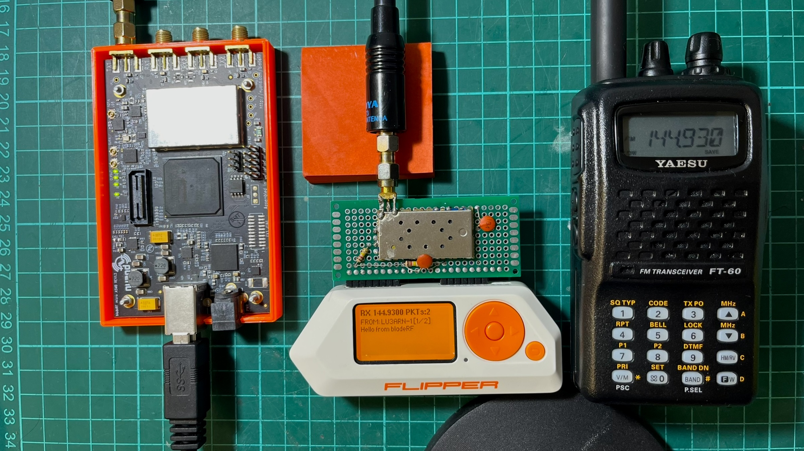
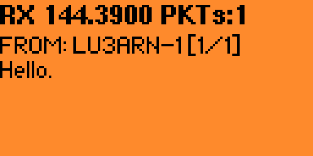
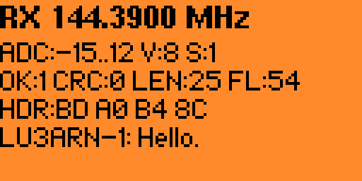

A few weeks ago, I stumbled upon a cool project in which [YO3GND](https://www.yo3gnd.ro/) uses the [Flipper Zero's internal CC1101 radio as an APRS UHF transmitter.](https://github.com/yo3gnd/flipper-zero-aprs-tx) The C1101 radio can transmit and receive from 300 to ~1 GHz and is the core of the Flipper Zero's Sub-GHz radio. I thought it was a very cool project, but down here in Argentina, APRS is used on VHF at 144.390 MHz.

[](../assets/images/flipper-zero-aprs-trx-1/header.jpeg){:target="_blank"}


Since I have like four or five DRA818V modules, I thought of forking off Richard's project and porting it to use an external DRA818V module (also compatible with SA818, and their UHF versions), and as I usually do, I ended up falling through a deep hole and building a full APRS transceiver (TX and RX) for the Flipper over a few days (or probably weeks, heh).

> The code is available at [github.com/reynico/flipper-818-aprs](http://github.com/reynico/flipper-818-aprs)

- [Transmission](#transmission)
- [Reception](#reception)
  - [The BladeRF test rig](#the-bladerf-test-rig)
  - [Attempt 1: Goertzel demod](#attempt-1-goertzel-demod)
  - [Attempt 2: Delay-and-multiply](#attempt-2-delay-and-multiply)
  - [The timing nightmare](#the-timing-nightmare)
  - [The frame dump breakthrough](#the-frame-dump-breakthrough)
  - [The noise gate problem](#the-noise-gate-problem)
  - [Hardware changes that affected decode](#hardware-changes-that-affected-decode)
  - [Filter polarity](#filter-polarity)
  - [TIM2 ISR-driven ADC sampling](#tim2-isr-driven-adc-sampling)
- [UI work](#ui-work)
- [Conclusion](#conclusion)


# Transmission

Doing TX with the DRA818 module was quite straightforward. The existing AFSK waveform generator from Richard's project produces a square wave representation of the [Bell 202 signal](https://www.zilog.com/docs/modem/appnotes/an0002.pdf). Instead of feeding it to the CC1101's async TX, output it to a GPIO pin (A4), connected to the DRA818's microphone input via a coupling cap and a resistor. The DRA818 FM-modulates and transmits it. 

[](../assets/images/flipper-zero-aprs-trx-1/flipper-tx-openwebrx.jpeg){:target="_blank"}

Since I run my own [OpenWebRX+]() server with an AX.25 decoder enabled, I was able to test it in just a few hours. TX was suspiciously easy (of course, because it was based on Richard's work), but very satisfying since I was pushing around 500 mW of FM power to the air, which is like 50x more than the CC1101 internal module.

<iframe width="100%" height="500px" src="https://www.youtube.com/embed/i2zG8IQZOOk" frameborder="0" allowfullscreen></iframe>


# Reception

Up to this point, I had a perfectly working and stable AX.25 transmitter, but I wanted to decode APRS traffic in real time. Since the DRA818 modules can also receive, I could do that and try to parse the audio into text with the Flipper Zero.

I really forgot how difficult it was to demodulate a digital signal from audio. AFSK demodulation requires reading audio samples from the DRA818's speaker output at a precise, consistent rate of 13,200 Hz, then running a tone discriminator to determine whether each bit period contains a 1,200 Hz (mark) or 2,200 Hz (space) tone.

## The BladeRF test rig

While there is some APRS traffic in the city, I found it annoying trying to catch a signal and also test the demodulator, there were too many moving parts that I didn't know if they were even moving together so I decided to use my BladeRF xA4 as an AX.25 packet generator that helped me a lot during debugging because I was able to play with messages, TX power, timing, antennas. All the tests below were performed with the BladeRF as the test rig, then moved to an open field for more realistic testing.

[](../assets/images/flipper-zero-aprs-trx-1/bladerf-flipper-ft60r.jpeg){:target="_blank"}


## Attempt 1: Goertzel demod

After reviewing other implementations, I decided to go with a software-based [Goertzel demodulator](https://en.wikipedia.org/wiki/Goertzel_algorithm). Goertzel computes the energy at a single frequency efficiently. For AFSK with two known frequencies, running Goertzel twice per block and comparing magnitudes seemed to be the best approach. 

The problem was that Goertzel is a block-based algorithm: it processes a fixed window of N samples and returns a single answer. For AFSK demodulation, you need to know where each bit starts and ends (aka clock recovery), and Goertzel blocks do not naturally align with bit boundaries. I was chopping the audio into arbitrary 11-sample chunks, hoping they'd align with the actual bits. (They didn't).

## Attempt 2: Delay-and-multiply

The delay-and-multiply discriminator takes a different approach: instead of analyzing blocks, it works sample-by-sample. Each sample is multiplied by a delayed copy of itself. The DC component of the product is negative at 1,200 Hz and positive at 2,200 Hz. An [Infinite Impulse Response (IIR)](https://en.wikipedia.org/wiki/Infinite_impulse_response) [low-pass filter](https://en.wikipedia.org/wiki/Low-pass_filter) extracts this, and the sign indicates the tone. Unlike Goertzel, this gives a continuous discrimination signal that can be sampled at any point. Clock recovery nudges the sampling moment to align with actual bit centers. This was implemented in a worker thread using `furi_delay_us(68)` + `furi_hal_adc_read()` in a polling loop. I was polling as fast as I could and hoping the timing was consistent enough. This was an improvement over attempt 1 with a success ratio of around 20%, so it felt like progress, but not even close to reasonable by any means.

## The timing nightmare

The polling loop's effective sample rate depended on factors beyond the delay. It depended on everything:

1. `furi_delay_us(68)` is a DWT busy-wait
2. ADC read time via HAL mutex (~3-10us variable)
3. Demodulator processing time (~5-8us varies by code path)
4. RTOS tick preemption (1ms every ~1ms, with unpredictable duration)
5. GUI thread draw callback timing that affected RTOS scheduling
6. Volatile debug field writes (~5-7us, removing them broke decode)

All of this added up to an effective sample rate between 11,000 and 13,000 Hz, which drifted depending on which code paths executed. The delay-and-multiply discriminator is sensitive to the sample rate because it determines the phase relationship between the signal and its delayed copy. A 5% shift was enough to flip bit decisions. Here's where it got absurd. The worker thread included debug tracking code that used volatile writes to update ADC min/max values, LPF state, and flag counters at each iteration. Textbook throwaway instrumentation. 

```c
rx->dbg_adc_min = adc_min;     // volatile write
rx->dbg_adc_max = adc_max;     // volatile write
rx->dbg_mark = lpf;            // volatile float write
rx->dbg_space = mag;           // volatile float write
rx->dbg_flags++;               // volatile increment
```

These writes added about 5-8 microseconds of overhead per loop. When I removed them to "clean up" the code, the loop ran faster, the sample rate shifted by ~9%, and the demodulator stopped decoding entirely.

It got worse. Changing the draw function, which runs in a completely separate GUI thread, also affected the decode rate. More `canvas_draw_str` calls in the draw callback meant better decoding. Fewer calls, worse decoding. The RTOS scheduling interaction between the GUI thread and the worker thread created an indirect coupling between what was on screen and packet decoding. I was debugging a demodulator that broke when you changed the font rendering.

## The frame dump breakthrough

I added code to dump failed frames to the Flipper's SD card and compared byte-by-byte with the expected data:

```
Expected: 82 A0 B4 8C 98 A0 60 A8 8A A6 A8 60 62 63 03 F0 3E 42...
Received: 82 A0 B4 8C 98 A0 60 28 B1 2A 98 D8 D8 00 BC 8F 10 5B...
                               ^^ first error at byte 7
```

First 7 bytes (56 bits) were perfect, then a 51.7% bit error rate due to pure random noise. The demodulator lost sync after ~47ms and never recovered. I didn't understand whether something was flipping out the bytes just after a specific time window, or if something else was going on.

At this point I noticed that the script I was using in the BladeRF test rig generated audio at 22,050 Hz. `22050 / 1200 = 18.375` samples per bit, rounded to 18, producing 1225 baud (2% error). Over a 288-bit frame, this compounds to ~6 bits of drift. While not much, I thought it was corrupting the demodulator, so I fixed it by using fractional-sample accumulation, alternating between 18 and 19 samples per bit to maintain an exact 1200 baud. This hypothesis turned out to be false, but it was a good catch anyway.

## The noise gate problem

The demodulator had a noise gate: `if(|lpf| > 500) process_bit()`. This was meant to suppress idle noise. But the LPF output has a 2f ripple component (2,400 Hz for mark). The ripple caused the LPF to cross zero multiple times per bit period, dropping the magnitude below the threshold. The gate was skipping bits at tone transitions, particularly those carrying the most information. With the gate removed, idle noise generated false frames. With it enabled, the bit drops corrupted data. The noise gate was redesigned later.

## Hardware changes that affected decode

For the audio input, I used two 120k/120k bias resistors (what I had on hand). The 120k resistors prevented the ADC's sample-and-hold capacitor from fully charging, creating an unintended low-pass filter that smoothed the signal. With 10k (that seemed to be the correct impedance), the ADC read a clean, unfiltered signal that the demodulator couldn't handle as well. I reverted to 120k to achieve natural smoothing, so I guess theory doesn't always hit the same.

The first DRA818 module I picked from the radio box was one I used before for another project, and I have a bad gut feeling about it. I used it because I couldn't remember the problem. Turns out that after a few minutes of turning it on, this first module ended up with lower audio output that clipped at the ADC maximum. This distorted waveform (effectively a square wave) worked well with the delay-and-multiply because the products had sharp transitions. Up to this point, I spent a few hours trying to understand what was going on. At the end, I just replaced the module. The replacement module had clean, symmetric audio, which produced a more ambiguous discriminator output.

Given the low audio output on the first module, I discovered that lowering the DRA818V volume (2-3) gave more accurate byte decoding but weaker signals. Higher volume (8) yielded stronger signals but more bit errors due to the 2f ripple. The sweet spot depended on which DRA818V module was installed, so I also added a configurable volume and squelch setting to the menu.

## Filter polarity

The DRA818 has configurable audio filters, de-emphasis, high-pass, and low-pass filters controlled via the `AT+SETFILTER` command. I was sending `AT+SETFILTER=0,0,0` assuming 0=off. At some point during debugging, I wondered whether that was ok, so I looked it up. The official Dorji datasheet states the opposite: 0 = on, 1 = off. The DRA818V was running with de-emphasis, high-pass, and low-pass filters all ENABLED throughout the entire debugging effort. 

De-emphasis attenuates high frequencies on receive. For APRS, this meant the 2200 Hz space tone was attenuated relative to the 1200 Hz mark tone, creating asymmetric amplitudes that made the discriminator pattern-sensitive. These filters work really great for human voice but not for AX.25 packets. Setting `AT+SETFILTER=1,1,1` to actually disable all filters increased the decode rate from 20% to ~50%.

In retrospect, this (I think) explains why the first 7 bytes of each frame decoded correctly while the rest were garbage. The destination address (bytes 0-6) decodes correctly because uppercase ASCII shifted left by 1 is mark-heavy. The payload has more balanced mark/space patterns, which are more susceptible to de-emphasis distortion. Two more days of debugging spent here.

## TIM2 ISR-driven ADC sampling

Up to this point, I had decided that the polling approach was fundamentally broken. No amount of parameter tuning could overcome RTOS timing jitter. Here is the somewhat final architecture diagram that worked best for me.

<div class="mermaid">
graph TD
      TIM2["TIM2<br/>64 MHz / 4848 = 13201 Hz"] -->|TRGO<br/>hardware trigger| ADC1["ADC1<br/>starts conversion at exact timer tick"]
      ADC1 --> ISR["TIM2 Update ISR"]
      ISR --> |stores sample| BUF["Circular Buffer<br/>256 x int16_t"]
      BUF --> |notifies every<br/>64 samples| WORKER["Worker Thread"]

      subgraph ISR_DETAIL [" "]
          direction LR
          I1[Wait ADC EOC] --> I2[Read 12-bit result] --> I3[Store in buffer] --> I4[Notify worker]
      end

      subgraph WORKER_DETAIL [" "]
          direction LR
          W1[Drain buffer] --> W2[Delay-and-multiply] --> W3[Carrier noise gate] --> W4[AX.25 framing] --> W5[APRS decode]
      end

      ISR -.-> ISR_DETAIL
      WORKER -.-> WORKER_DETAIL
</div>

TIM2 triggers the ADC via hardware TRGO. The conversion starts at the exact timer tick, not when the ISR enters. ISR latency (1-2 uS) only affects the result collection, not the sample acquisition, and the sample rate is now crystal-locked at 13,201 Hz (~0.01% error).

The choice of 13,200 Hz was deliberate. It divides evenly into 1,200 baud, yielding exactly 11 samples per bit, so I avoid fractional accumulation and thus avoid drift. The demodulator parameters are now deterministic and don't change when the code is modified, so enabling or disabling debug mode or drawing the screen won't affect decoding.

The worker thread is now fully decoupled from timing, it sleeps via `furi_thread_flags_wait` and wakes when samples are available, processes them in bursts, then sleeps again. This way, I avoid `furi_delay_us` and busy polling.

The noise gate needed a redesign. The old gate skipped individual bit decisions when the LPF magnitude fell below the threshold, which occurred at every tone transition. The new gate separates carrier detection from bit processing:

```c
// Per-sample: track carrier
if(mag > threshold) { carrier_present = true; silence_count = 0; }
else { silence_count++; if(silence_count > 220) carrier_present = false; }

// Per-bit: only at decision point
if(bit_phase >= 11) {
    if(carrier_present) { /* decode bit, process AX.25 */ }
}
```

Once the carrier is detected, ALL bits are processed regardless of instantaneous LPF magnitude dips. After 20-bit periods of silence, reset to the hunt state. This achieved a 100% success rate in decoding AX.25 packets, even under harsh conditions with a low signal-to-noise ratio. 

<iframe width="100%" height="500px" src="https://www.youtube.com/embed/M0hjUN8xKgM" frameborder="0" allowfullscreen></iframe>

# UI work

Since I forked off Richard's project, I integrated my DRA818 work into the UI Richard designed, but quickly realized it wouldn't work because everything was built to support both C1101 and DRA818; both modules require different configuration settings, and behave differently. Since this project evolved into building an APRS transceiver, I decided to remove the CC1101 settings and stick with the DRA818 settings.

[](../assets/images/flipper-zero-aprs-trx-1/rx.png){:target="_blank"}

The reception screen accepts multiple multi-page messages, so you can read large messages and also read older ones. Messages are not stored anywhere else, but I might add SD card logging later.

The settings view allows configuring the frequency from a list of default options, including a custom frequency, configuring TX lead-in and preamble times to avoid laggy receivers missing packets, RX volume and squelch level, enabling haptics (sound and vibration) when a message is successfully decoded, which is handy when you are not checking the Flipper's screen, and debug screens for transmission and reception that helped me a lot to check what was going on, especially during reception of messages. 

[](../assets/images/flipper-zero-aprs-trx-1/rx-debug-on.png){:target="_blank"}

The debug RX screen shows the demodulator's internal state in real time. ADC is the raw signal amplitude range. During a packet, you'll see it swing wide (e.g., -500..480), during silence, it stays near zero. V and S are the current DRA818 volume and squelch settings. OK counts successfully decoded packets, CRC counts frames that were assembled but failed the checksum. A high CRC count with zero OK means the demodulator is close, but the bit accuracy isn't there yet. LEN is the byte length of the last attempted frame. FL counts detected AX.25 flag bytes (0x7E). These mark frame boundaries, so a high flag count confirms the demodulator is at least finding the preamble.

# Conclusion

TX is solid,  [OpenWebRX+]() decodes packets with no effort. RX hits 100% on bench tests and picks up real APRS traffic in the field, though the DRA818's receiver sensitivity is the weak point. The module has no front-end LNA, so it relies purely on antenna gain and signal strength. I'm planning to add an [SPF5189Z](../assets/images/improving-filtering-sdr-1/SPF5189Z.PDF) low-noise amplifier on the receive path, switched out during TX via a MOSFET on the PTT line. The code is available at [github.com/reynico/flipper-818-aprs](http://github.com/reynico/flipper-818-aprs)