My VHF OpenWebRX+ receiver was working flawlessly for months, and in the last few weeks I've been thinking of building something similar for the UHF band, given that there is a lot of satellite activity nowadays.

- [The turnstile antenna](#the-turnstile-antenna)
- [Adding an LNA and the cavity filter V1](#adding-an-lna-and-the-cavity-filter-v1)
- [Replacing the antenna](#replacing-the-antenna)
- [Cavity filter V2](#cavity-filter-v2)
- [Conclusion](#conclusion)

# The turnstile antenna

At first I thought of adding a second SDR receiver to the OpenWebRX+ instance. Still, later I realized that I could convert a second SDR into a satNOGS station! Since I had some spare LMR-400 cable and PVC tubing, I built a double-turnstile antenna and hooked it up to the RTL-SDR v3 receiver.

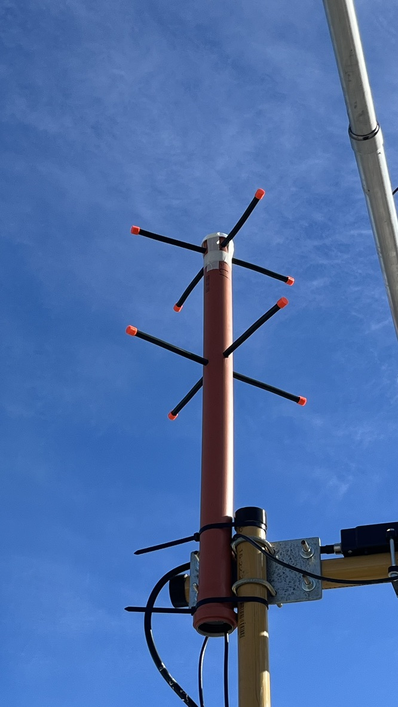

I have used the instructions from I6IBE to build the antenna, taking care of the phasing stubs; nevertheless, I haven't found any good resonance points anywhere near 436 MHz. Here are the instructions if someone else is interested in building it:

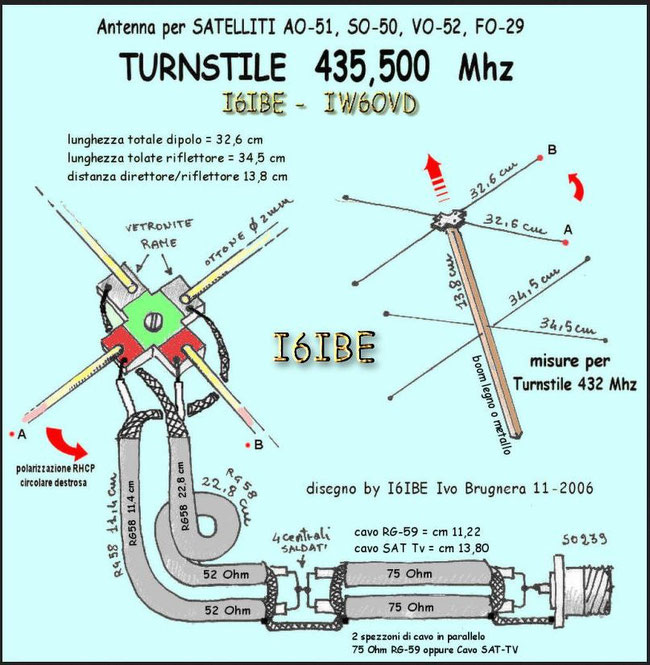

I haven't found a way to tune up the VSWR correctly; after some investigation, I learned that the best way is to tune up either the two parallel 75-ohm stubs or the two 52-ohm phasing coaxes. The stub design was also correlated with [these instructions I found](https://www.radioamatoripeligni.it/i6ibe/turnhard/turnhard.htm).

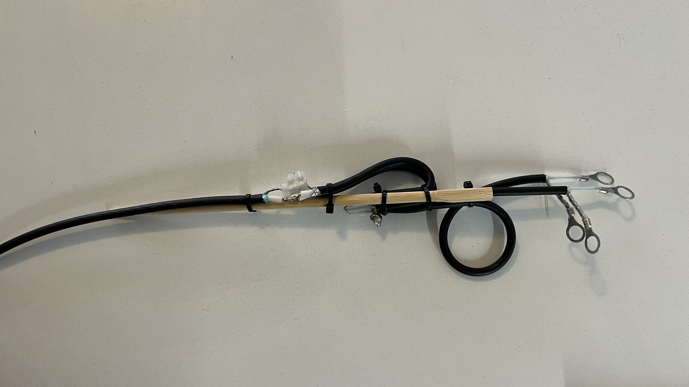

I built a few versions varying lengths and trying other 75-ohm coaxes like RG-6 and RG-59, but none gave me a great VSWR result or a great resonance point at ~436 MHz. I made sure to use the correct VF for each cable; nevertheless, I haven't had any luck tuning them correctly.

[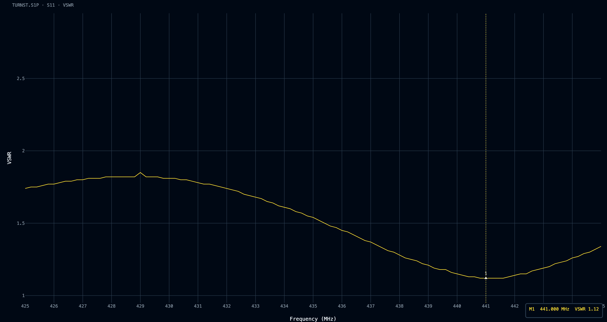](../assets/images/satnogs-station-1/TURNST_vswr_20260805.png){:target="_blank"}

I built a few versions varying lengths and trying other 75-ohm coaxes like RG-6 and RG-59, but none gave me a great VSWR result or a great resonance point at ~436 MHz. I made sure to use the correct VF for each cable; nevertheless, I haven't had any luck tuning them correctly.

# Adding an LNA and the cavity filter V1

I thought, what if I set up an SPF5189z LNA in front of the RTL-SDR receiver? My first thought was that it might overload due to the high amplification bandwidth of that LNA, and I would need to build a bandpass filter for ~436 MHz.

I ran a [small Python script](../assets/files/satnogs-station-1/waterfall.py) to parse the data generated from rtl_power. I swept from 30 to 750 MHz, as I was mainly interested in how the ISDB-T signals around 520 to 600 MHz may affect the reception.

```bash
rtl_power -f 30M:750M:25k -g 30 -T -i 30 -e 10m gain30-10min-30-750mhz-step25khz.csv
```

[The script](../assets/files/satnogs-station-1/waterfall.py) brings up a web server to analyze the CSV files in the same folder so one can compare waterfalls with just two browser tabs open, as well as export the generated graphs

[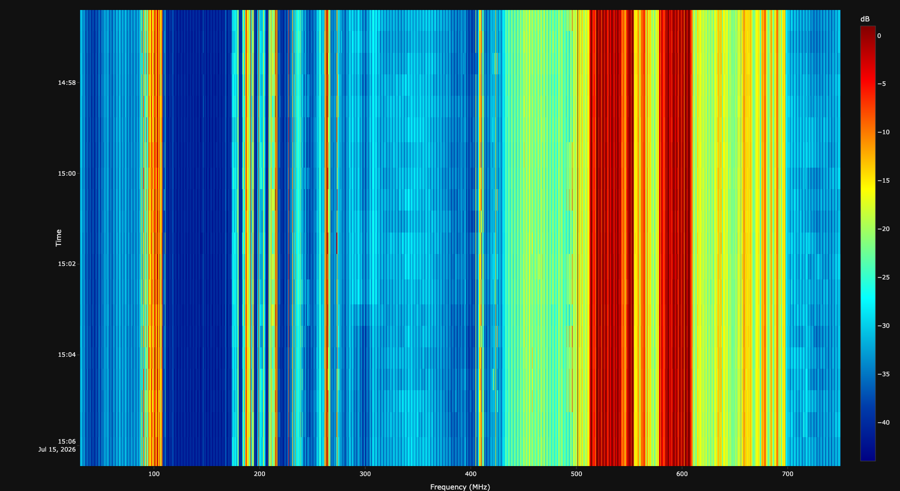](../assets/images/satnogs-station-1/plot-30-750MHz-gain20-no-filter.png){:target="_blank"}
> [Download the .csv file](../assets/files/satnogs-station-1/gain20-10min-30-750mhz-step25khz-direct.csv)

And indeed, the ISDB-T strong signals were there, overloading almost from 400 to 700 MHz, so I put my hands on building a filter. I don't have any experience with filters, so I learned a lot with this. I actually went *too* deep at some point, and it took me almost two months of experimentation.

It's been a while since I was wondering how a cavity filter would perform. Since I have never built one, and since the wavelength of the UHF band is fairly short, I put my hands to work and built one. Let's call this one the cavity filter V1.

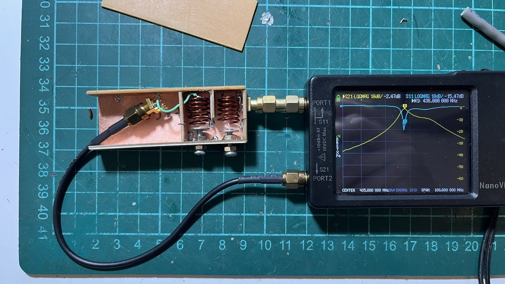

I didn't have spare double-sided PCB pieces, so I used Pertinax single-sided PCBs. While not ideal, they're acceptable for a first filter. For the calculations, I used the [Changpuak's Helical Bandpass filter designer](https://www.changpuak.ch/electronics/Helical_Bandpass_Filter_Designer.php).

[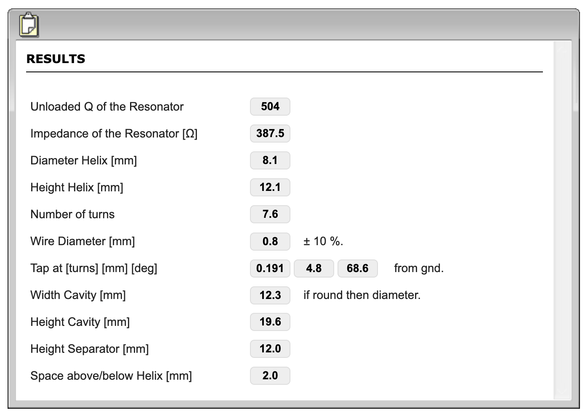](../assets/images/satnogs-station-1/changpuak-calculator-results.png){:target="_blank"}

The center frequency I set was 435 MHz with a bandwidth of 10 MHz. The calculations gave me:

- Helix diameter: 8.1 mm
- Helix length: 12.1 mm
- Number of turns: 7.6
- Wire gauge: 0.8 mm
- Cavity Width x Height: 12.3 x 19.6 mm
- Separator height: 12 mm

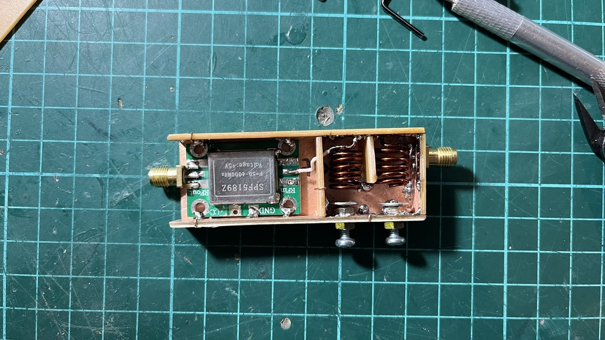

I only had 1.02 mm (AWG 18) enamel wire so that the coil would be a bit sturdy. I chose an 8 mm drill to wind the coil and used [https://www.cutlistoptimizer.com/](https://www.cutlistoptimizer.com/) to see how to cut the PCB to get all the pieces. I made the pieces a bit longer so I could install the LNA inside the same filter assembly.

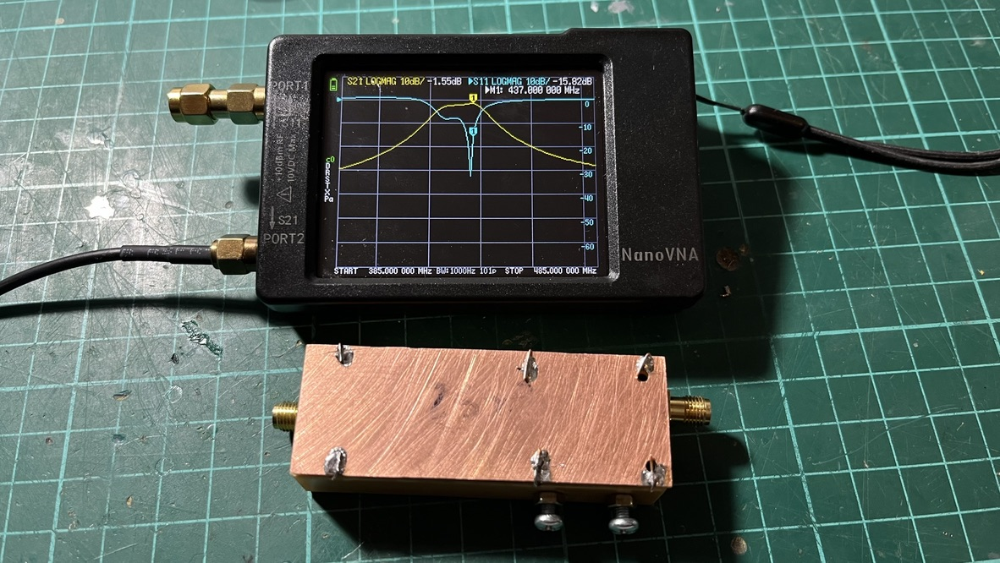

TL;DR: Each cavity measured 12.5 mm wide, 22 mm long, and 13 mm tall. I had to tune the coils a bit; one ended with 6 1/2 turns, and the other with 5 1/2 turns. I used two M3 x 10 mm screws and soldered M3 x 9 mm washers to the ends of the screws for tuning. The taps (in and out) were set in around 0.25 to 0.3 turns each. During my experiments, I noted that the tap position is one of the most important things to tune out. If the tap is misplaced, reflection (S11) ends up too high.

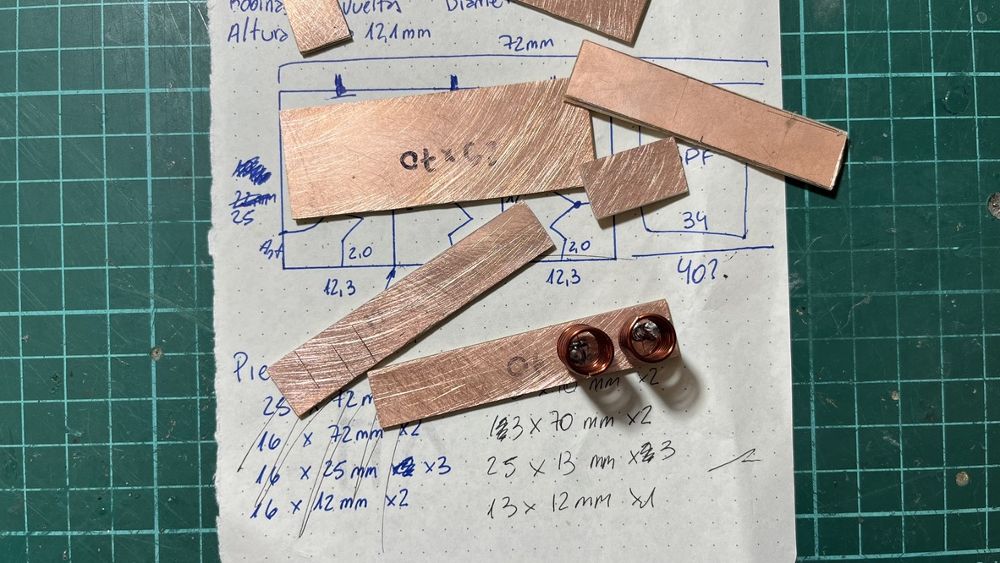

First, I cut all the pieces with a knife, then sanded them to fit together. The PCB thickness is relevant; it adds (in my case) 1.6 mm to each measurement, which is not negligible, so you may want to take that into account when calculating the cuts.

Then mounted the two coils, soldering them to the 70 x 13 mm board, spaced 12.5 mm apart. Each coil is mounted in the center of each cavity, with very small room for the coupling window. The coupling window (or separator) is about 12 x 13 mm. I tried creating a larger window (by cutting a smaller separator of 10 x 13 mm), but the filter suffered from over-coupling (S21 showed two humps with a sag in the middle). Nevertheless, I think the filter ended up under-coupled, since the S11 return loss was not good outside the 5 MHz bandpass, and we expected the filter to be 10 MHz wide

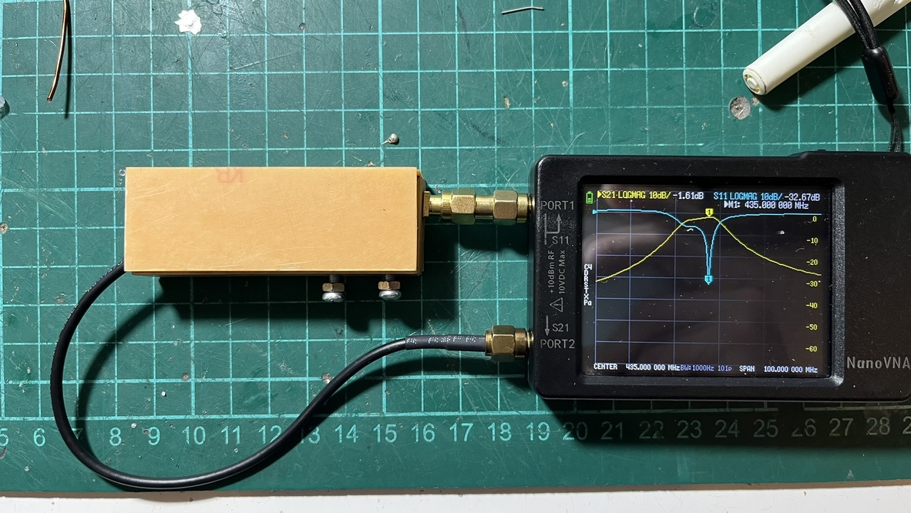

While the filter did get, let's say, “ok” S21 attenuation of around -1.7 dB across our interest frequency window, the S11 reflection levels were a bit mediocre. I was expecting −15 dB or better return loss, hence a low VSWR across the passband. A quick note on terminology, because I mixed these up myself for weeks: S11 is return loss (how much power bounces back at the input), passband S21 is insertion loss (how much the signal is attenuated going through). Stopband S21 is rejection (how well the filter kills what you don't want).

[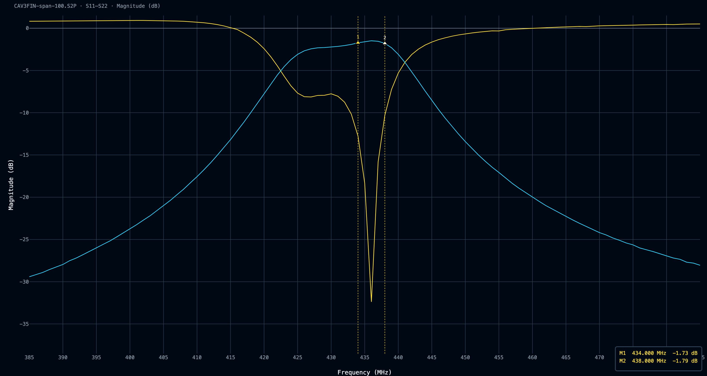](../assets/images/satnogs-station-1/CAV3FIN-span-100_db_20260805.png){:target="_blank"}
> [Download the .s2p file](../assets/files/satnogs-station-1/cavity-v1-433-span-100.S2P)

I made a few tweaks to the coils; at first, they were wound over an 8 mm-diameter drill, which was too much. There was little to no space between the coils and the walls, and they touched constantly, losing resonance. I rewound the coils in a 7 mm drill, and that was way better.

I spent over 3 hours tuning the filter; I cannot tell you how sensitive it is to almost everything. Moved the separator 0.5 mm? You lost 4 dB in S21. Is the filter case not fully closed? The resonant frequency is now 3 MHz higher. The best I could get was around -1.47 dB of insertion loss with -12 dB of S11 rejection, but with a very strange S11 curve, where it seems one of the cavities is lost (hence, just one dip), so I decided to hook it up to the turnstile antenna and the LNA, even though I had concerns at multiple levels.

[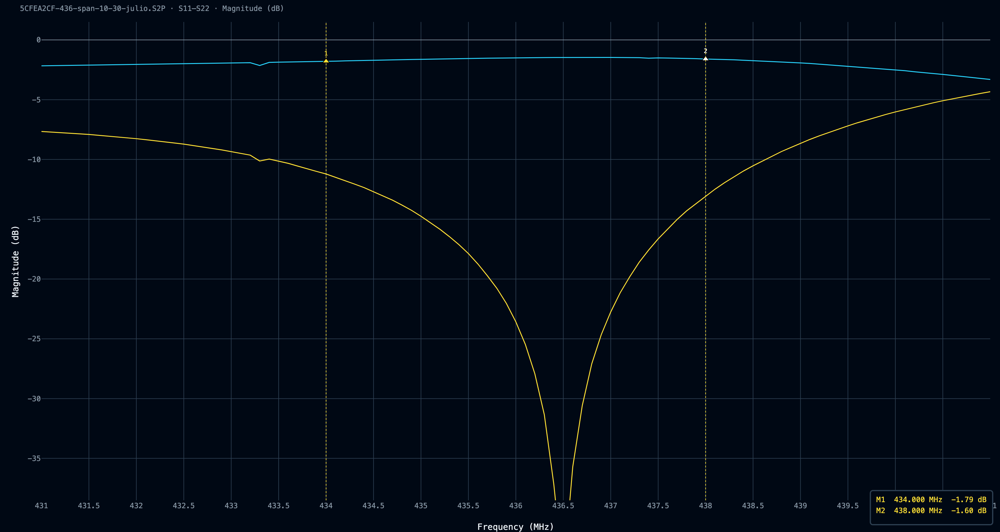](../assets/images/satnogs-station-1/5CFEA2CF-436-span-10-30-julio_db_20260805.png){:target="_blank"}
> [Download the .s2p file](../assets/files/satnogs-station-1/cavity-v1-436-span-10.S2P)

After mounting the cavity filter, I re-ran the `rtl_power` script to check how things were looking now

[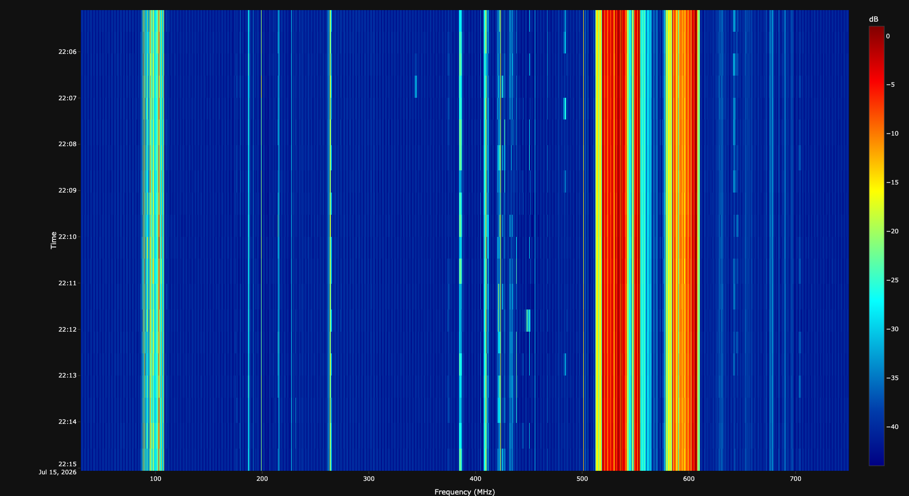](../assets/images/satnogs-station-1/plot-30-750MHz-gain20-cavity-filter.png){:target="_blank"}
> [Download the .csv file](../assets/files/satnogs-station-1/gain20-10min-30-750mhz-step25khz-cavity.csv)

That was much better! While the strong ISDB-T signals were still there, now they weren't leaking RF power 300 MHz wide; also, the broadcast commercial FM stations were looking tidier, and the sub-FM noise was gone as well. Despite the filter doing filter things, when I swept the VNA with a 300 MHz span, I noticed that the bell curve didn't go lower than -40dB. While I understand the Nano VNA has limited dynamic range, I expected a bell curve shape.

[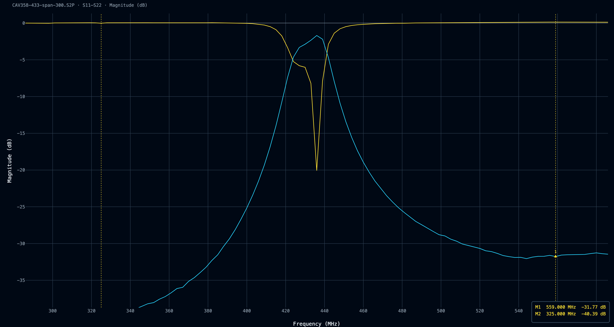](../assets/images/satnogs-station-1/CAV358-433-span-300_db_20260805.png){:target="_blank"}
> [Download the .s2p file](../assets/files/satnogs-station-1/cavity-v1-433-span-300.S2P)

I did a last sweep from 1 MHz to 1 GHz, taking into account the Nano VNA's limited resolution, of course, but concentrating more on the shape than on the power levels; the flatness on the high side of the filter stayed at ~ -40 dB. Here I started to hypothesize an RF leakage in the filter. A flat line usually means you are looking at leakage around the filter, through the gaps in the box, or through the VNA and the fixture itself. However, I was very tired, so I called it a day and moved on.

[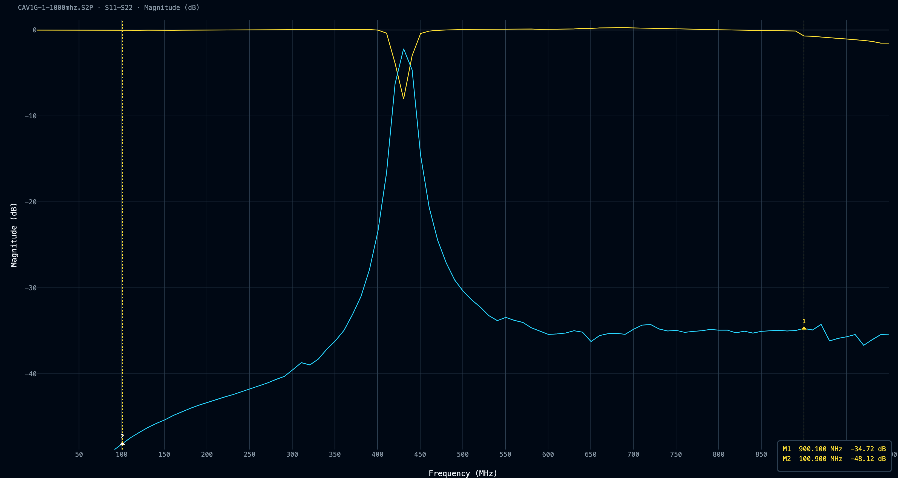](../assets/images/satnogs-station-1/CAV1G-1-1000mhz_db_20260805.png){:target="_blank"}
> [Download the .s2p file](../assets/files/satnogs-station-1/cavity-v1-1-1000mhz.S2P)


# Replacing the antenna

During my investigation, I found a pretty neat QFH antenna design made of 3D-printed parts by [SA0PEJ](https://sa0pej.wordpress.com/3d-print-and-build-qfa-antenna/), so I put my hands on it. Jan, SA0PEJ, did an incredible journey through quadrifilar helicoidal antennas, which is [well worth reading](https://sa0pej.wordpress.com/qfa-antenna/).

Printing was over 12 or 13 hours. I made it without supports. I could have improved printing quality with supports, but this is a test version, and I don't care much about surface quality.

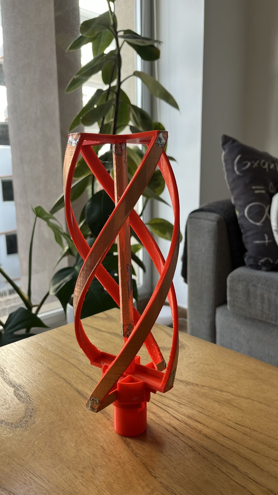

I bought a roll of copper tape, 10 mm wide, to make the elements. It is incredible how easy it is to solder this thing.

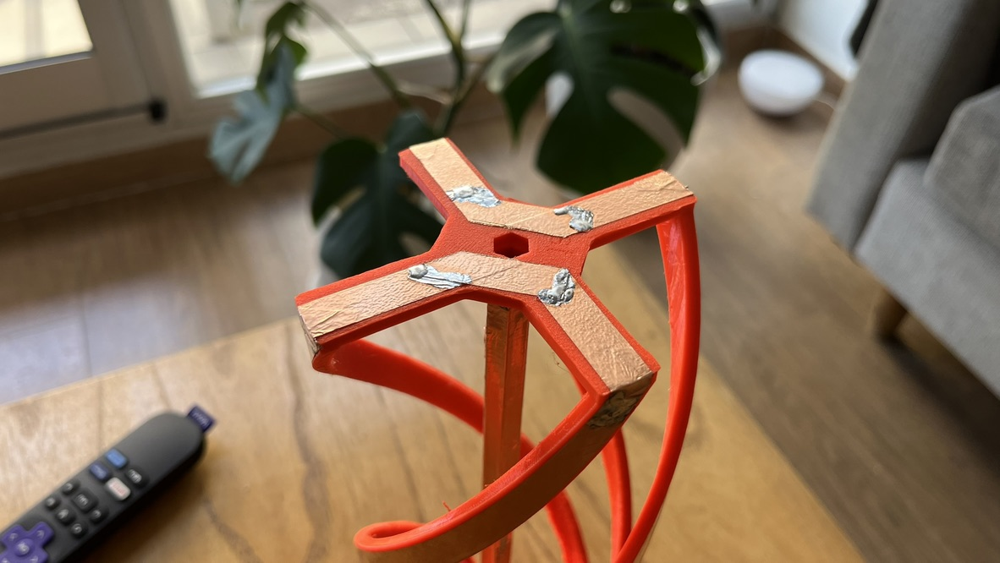

The feed line is drawn from the center of the antenna, and the antenna is fed from the top. A sleeve or bazooka balun is built with the same copper tape, by masking the central tube, taking care to maintain lambda/4 lengths, or 175 mm for this antenna.

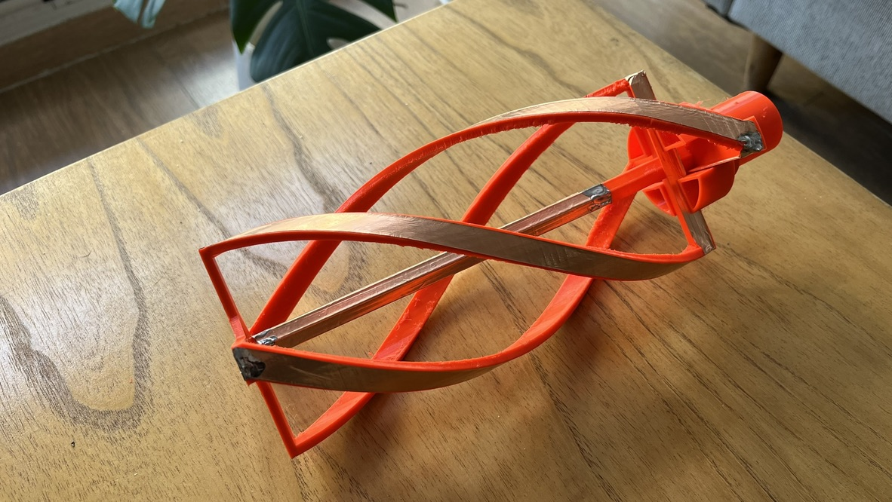

I printed this first version in PLA because it's what I had spare. Two separate things push the resonance around here: the printed geometry itself (scale and shrinkage move the element lengths) and dielectric loading (the plastic sitting against the conductors has a permittivity above air, which lowers the resonant frequency for the same physical size). Mine ended up slightly large and resonating a bit low. For a receive-only station, I don't think it's a big deal.

If you build one, use PETG. PLA's glass transition is around 60 °C, and a plastic antenna in direct summer sun will soften and sag; on a QFH, the element geometry *is* the phasing, so a sagging former is a detuned antenna. This one is a test version, and I'll mine with that; the permanent one gets reprinted in PETG.

The QFH was mounted using the same feed line, the same cavity filter V1, and the same LNA I was already using. I just tuned the gain a bit. That's deliberate: the only variable that changed between these two datasets is the antenna itself; everything downstream stayed identical, and both ran for weeks over many passes. I left it working until I had enough comparison data between both antennas, and I got… Amazed.”

[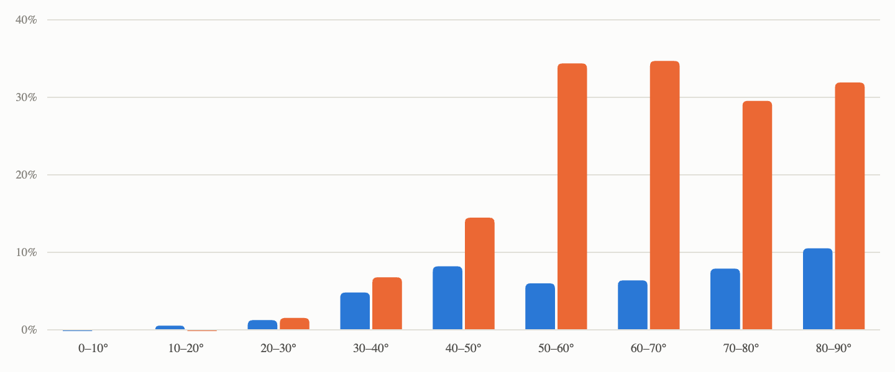](../assets/images/satnogs-station-1/antenna-comparison.png){:target="_blank"}

I don't think the turnstile is a bad antenna at all. The thing is that I couldn't build one accurately enough.

The obvious suspect with a coaxial phasing harness is velocity factor. Solid-PE RG-59 runs around 0.66 and foam RG-6 around 0.85, so cutting both to the same physical length gives you two very different electrical lengths. I did the math separately for each cable and cut each one accordingly; nevertheless, that didn't fix the antenna resonance point.

What's left is harder to see with the measurement I was taking. S11 through the assembled harness gives you a single number for the whole thing. Hence, an asymmetry between the two dipoles, a phase error in the T junction, and wrong reflector spacing all look identical from the connector. Without properly choking the VNA lead, you are also partly measuring common-mode current on the feedline instead of the antenna. The right way to debug it is to characterize each dipole and each harness section individually, before assembly.

# Cavity filter V2

Back when I built the first cavity filter, I ended with results that were not so good. So I started to play a bit with what I will refer to as the cavity filter v2. Things I changed:

1. Cavity sizing: I deliberately decided to build bigger cavities to accommodate bigger (more diameter) coils.
2. Wind bigger-diameter coils: my rationale here was to increase the overall Qu of the filter (due to a combination of bigger cavities and bigger coils), while maintaining a coil diameter (d) over a shield size (S) ratio `d/S = 0.66`. The goal is to improve the passband loss. 
3. Thinner coupling wall: Instead of using a piece of PCB for the separator, I used a 0.05 mm copper sheet to separate each cavity from the others, gaining ~ 1.5 mm between them.
4. Get rid of the washers: Instead, use longer M3 screws for more precise adjustment. During my testing with the cavity filter V1, I felt like the screw tuning was VERY sensitive, in part because of the nature of the filter, but also due to the 9 mm washers in front of the coils.
5. Build the filter as a whole object: remove the LNA from the board so it is easier to do new measurements.
6. Use lots of copper tape to shield the filter box: in the V1 design, there were a lot of open gaps here and there in the box, most likely leading to RF leakage.

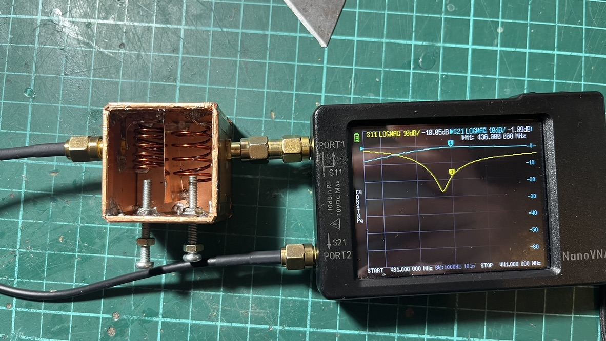

Each cavity of the cavity filter V2 measures 15 mm wide x 30 mm tall x 30 mm long. The coils were made with the same AWG 18 (1.02 mm) copper enamel wire, but this time wound over a 10 mm drill, 4.5 turns. The separator wall is 22 mm long, and the new bolts are M3 x 25 mm long.

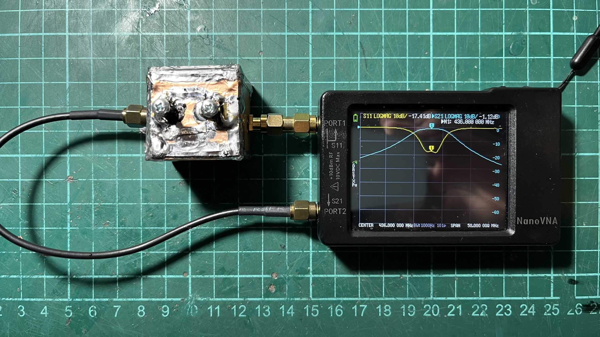

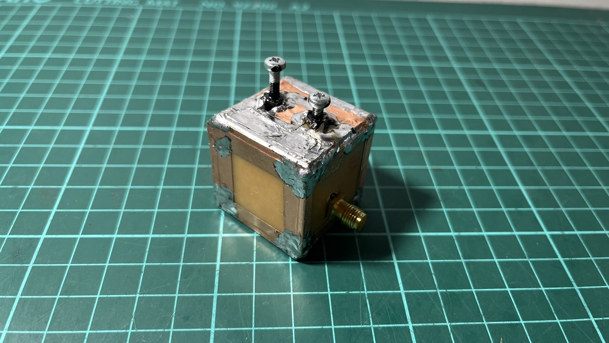

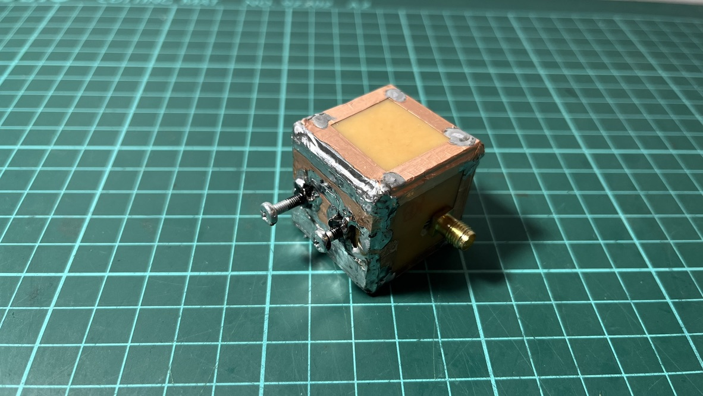

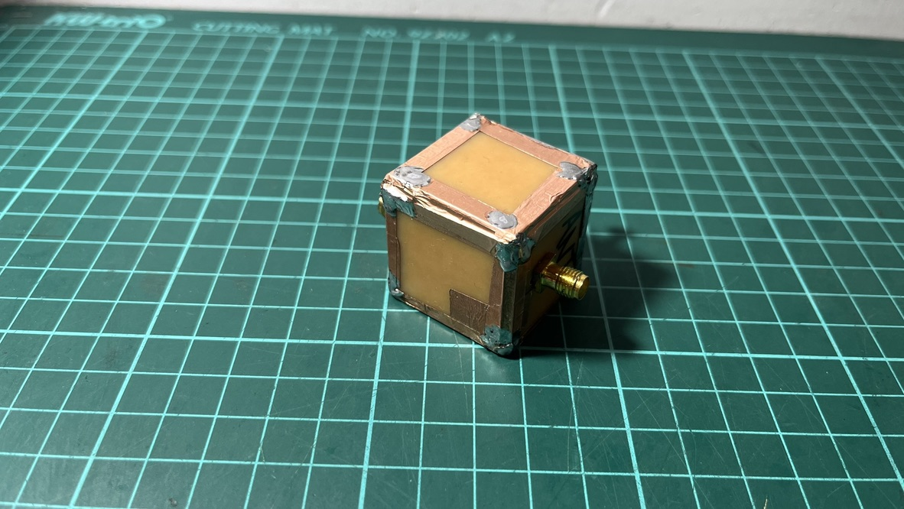

After some fine tweaking of bolts and coil geometry (I ended up stretching the coils to make them longer), the filter behaved very well, at least on the bench. Worst-case insertion loss measured −0.99 dB at the passband edges, and worst-case return loss was −17.65 dB at 436 MHz. My reading on the improvements is:


**Bigger cavities bought margin:** Roughly doubling the cavity size roughly doubles the theoretical unloaded Q, which on paper is worth something like 0.4 dB of insertion loss.

**Bigger cavities also bought tolerance:** In V1, the tap was a few millimeters of 1 mm wire, in a position where a couple of tenths of a millimeter materially changes the match; the solder joint itself perturbs the thing you are trying to set. V1's S11 dB return loss is the signature of an undercoupled tap, and I had no way to move it in that little box. At 15 mm, the tap becomes an easy task, and most of the return loss improvement came from finally being able to place it properly.

[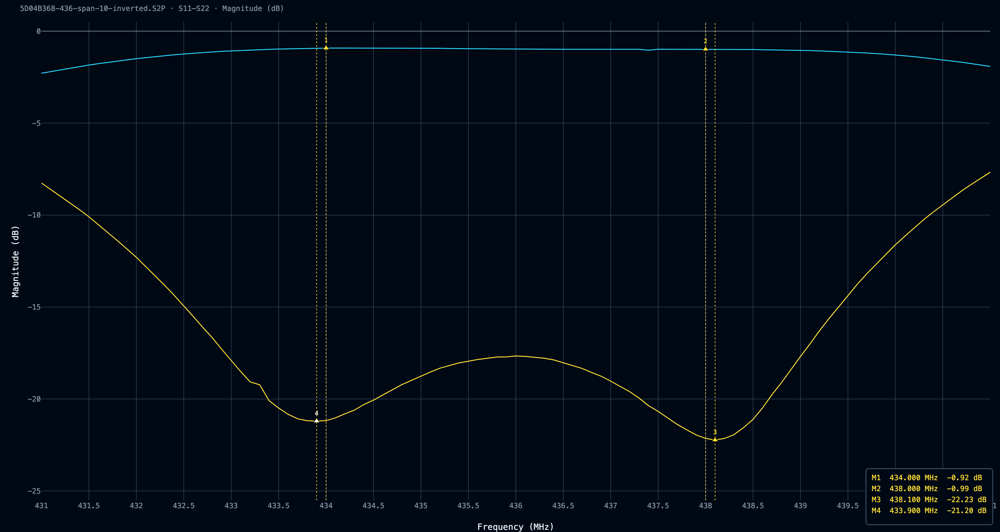](../assets/images/satnogs-station-1/5D04B368-436-span-10-inverted_db_20260806.png){:target="_blank"}
> [Download the .s2p file](../assets/files/satnogs-station-1/cavity-v2-436-span-10.S2P)

Something I hadn't taken into account before was the importance of a good S11 rejection level; I was too focused on the S21 bandpass attenuation and completely forgot to aim for good S11 values.

| S11 (return loss) | VSWR | Power reflected | Mismatch loss |
| ----------------- | ---- | --------------- | ------------- |
| −10 dB            | 1.92 | 10%             | 0.458 dB      |
| −15 dB            | 1.43 | 3.2%            | 0.140 dB      |
| −17.65 dB         | 1.30 | 1.7%            | 0.076 dB      |
| −20 dB            | 1.22 | 1.0%            | 0.044 dB      |
| −22 dB            | 1.17 | 0.6%            | 0.028 dB      |
| −30 dB            | 1.07 | 0.1%            | 0.004 dB      |

That table shows how S11 affects the VSWR, thereby the mismatch loss (added to the S21 bandpass loss) added to the system. TL;DR: virtually any S11 reflection better than -15 dB is good enough for a filter. 

[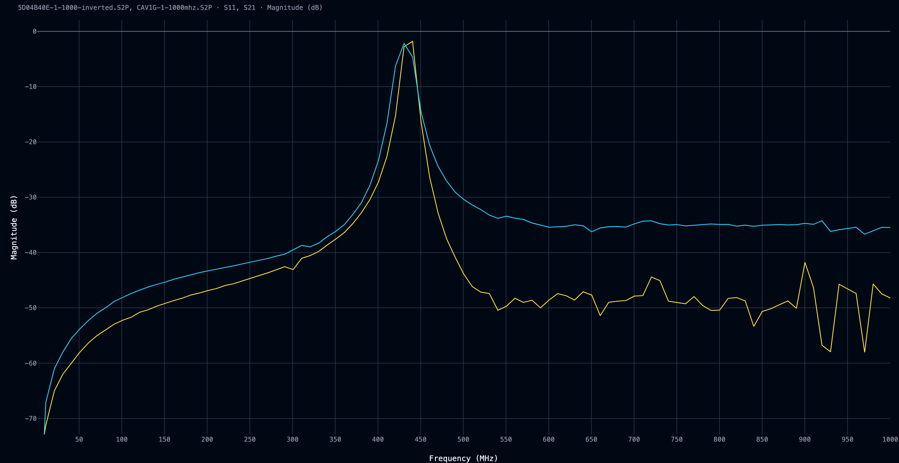](../assets/images/satnogs-station-1/compare_db_20260806.png){:target="_blank"}
> [Cavity V1 .s2p file](../assets/files/satnogs-station-1/cavity-v1-1-1000mhz.S2P), [Cavity V2 .s2p file](../assets/files/satnogs-station-1/cavity-v2-1-1000.S2P)


The 1 MHz to 1 GHz comparison graph from the Cavity Filter V1 (blue) and the Cavity Filter V2 (yellow) shows a clear improvement on the upper side of the band. Same NanoVNA, same fixture, so whatever the absolute numbers are worth, the comparison between the two traces is valid, and V2 is straightforwardly better.

[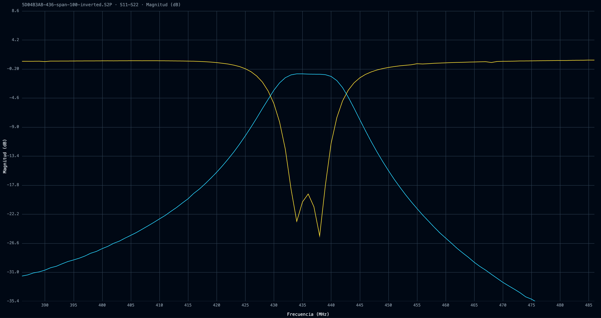](../assets/images/satnogs-station-1/5D04B3A8-436-span-100-inverted_db_20260813.png){:target="_blank"}
> [Download the .s2p file](../assets/files/satnogs-station-1/cavity-v2-436-span-100.S2P)

V1's trace flattens into a shelf on the high side, and as I mentioned earlier, a flat shelf is usually the measurement floor rather than the filter. So part of that gap is V1 leaking through an unsealed box, and part is the old setup simply being unable to resolve anything lower. Once V2 was sealed with copper tape on every seam, the trace dropped far enough to reveal rejection the earlier build couldn't achieve, and the earlier measurement couldn't see.

Both sweeps are 10 MHz per step, so treat any individual value as approximate. The raw .s2p files for both filters are available if you want to look at them yourself, along with the Python parser I used to turn `rtl_power` output into the waterfalls above.

S21 tells you what happens to a signal passing through something. Noise figure tells you what happens to the signal-to-noise *ratio*, because every component also adds its own thermal noise on top.

My filter's dB of insertion loss is ~1 dB of noise figure. My 1.5 m of coax is another half dB or so. And because the noise added by later stages gets divided by all the gain sitting in front of them, anything *before* the first amplifier counts at full weight, while anything after it barely counts at all. Mine currently runs:

QFH -> 1.5 m coax -> filter -> LNA -> SDR

That's roughly 1.5 dB of loss, plus the LNA's ~0.7 dB, for a system noise figure around 2.2 dB. The SDR's own 5-ish dB gets divided down by 20 dB of LNA gain and contributes almost nothing.

The better order is:

QFH -> filter -> LNA -> 1.5 m coax -> SDR

System noise figure drops to about 1.7 dB.

I haven't tuned it because the filter and the LNA currently live in the sealed box with the Raspberry Pi. Moving hardware up to the mast means climbing to the terrace every time I want to change anything, and it means the thing I'm measuring changes shape between tests. 

# Conclusion

This is the project I am putting more hours into recently. It is amazing to build things and have the tools to test them, in an amateur way, but testing them is.

So, was it worth it? I [wrote a while ago](https://blog.nico.ninja/what-are-you-obsessed-with/) about the line between obsession that drives you and obsession that eats you. This one stayed on the good side. The trick is knowing which one you're using before you start, and I didn't.

Next steps involve moving the filter and the LNA to the antenna and seeing whether that half dB is real. Reprint the QFH in PETG at the right scale. And check whether any of this shows up in the SatNOGS observation data.

Feel free to schedule your favorite observations in my station: [5042 - LU3ARN](https://network.satnogs.org/stations/5042/)!